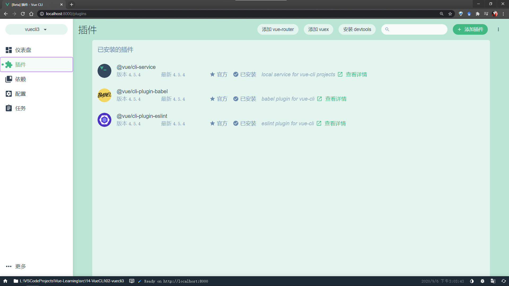
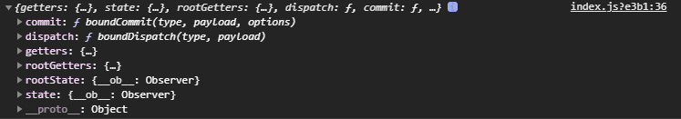

# Vue 学习记录

## 邂逅 Vue.js

**为什么学习 Vue.js？**

* Vuejs 应用场景越来越多，越来越方便。

**什么是 Vue.js？**

* Vue（读音｜vju:｜）
* Vue 是一个渐进式的前端框架。
    * 渐进式意味着你可以将 Vue 作为你应用的一部分嵌入其中；
    * 框架整体：Core + Vue-router + Vuex。
* Vue 是响应式的，当数据发生变化，或者从服务器中请求数据后，展示的数据会随之改变。
* Vue 有很多特点和 Web 开发中常见的高级功能
    * 解耦视图和数据
    * 可复用组件
    * 前端路由技术
    * 状态管理
    * 虚拟 DOM
    * ......
* 学习 Vue.js 的前提：具备 HTML、CSS、JavaScript 基础。

### Vue.js 安装

开发环境版本或者生产环境版本（https://cn.vuejs.org/v2/guide）

* CDN 在线引入
* 官网下载后引入
* **NPM 安装后引入**，方便后续 webpack 和 CLI 的使用。

### Vue.js 初体验

* 下载 vue.js 源码后，使用 `<script src='../js/vue.js'></script>` 来配置。

    ```vue
    <script>
      let app = new Vue({
        el: "#app",//用于挂载要管理的元素
        data: {
          message: "hello world!"
        }
      })
    </script>
    ```

* `new` 一个 Vue 实例，传入 `{}` 对象参数，包含 `el` 和 `data` 等属性。

#### Vue 列表展示

* `v-for` 指令，使用方式：

    ```vue
    <div id='app'>
      <ul>
        <li v-for='item in movies'>{{item}}</li>
      </ul>
    </div>
    
    <script>
      let app = new Vue({
        el: '#app',
        data: {
          movies: ['大话西游', '寻梦环游记', '泰坦尼克号']
        }
      })
    </script>
    ```

#### 案例-calculator

新增了 `methods` 属性和 `@click` 指令（等同于 `v-on:click`，**语法糖**），使用方式：

```vue
<div id='app'>
  <h2>当前计数：{{counter}}</h2>
  <button v-on:click="counter++">+</button>
  <button @click="sub">-</button>
</div>
<script src="../js/vue.js"></script>
<script>
  const app = new Vue({
    el: '#app',
    data: {
      counter: 0
    },
    methods: { // ES6 中不是这种写法
      sub: function () {
        console.log('sub executed');
        this.counter--
      }
    }
  })
</script>
```

### Vue 中的 MVVM


上个案例中的 MVVM：

* View 是 DOM；

* Model 是抽离出来的 obj；
* ViewModel 是创建的 Vue 对象。

它们之间如何工作：

* 首先，ViewModel 通过 Data Binding 让 obj 中的数据实时地在 DOM 中显示；

* 其次，ViewModel 通过 DOM Listener 监听 DOM 事件，并通过 methods 属性中的操作来改变 obj 中的数据。

### 传入 Vue 实例的 options 对象

官网包含所有选项，用时再查也可。

目前：

* `el`
    * 类型：string｜HTML Element （｜：或者）
        * `el: '#app'`
        * `el: document.querySelector(..)`
    * 作用：决定之后 Vue 实例会管理哪个 DOM。
* `data`
    * 类型：Object｜Function（组件当中 `data` 必须是函数）
    * 作用：Vue 实例对应的数据对象。
* `methods`
    * 类型：{[key: string]: Function}
    * 作用：定义一些属于 Vue 实例的方法，可以在其他地方调用，也可以在指令中调用。

### Vue 的生命周期


## 基础语法

### 代码规范

```javascript
indent = 2
const app = new vue({...})  // const app=new vue({...})
```

### 插值操作

#### Mustache 语法

*   如何将 `data` 中的文本数据，插入 HTML？
    *   响应式的 Mustache 语法：`{{...}}`。
    *   不仅可以放入变量，也可以是简单表达式：`{{ firstName + ' ' + lastName }}`、`{{ counter * 2 }}`。

#### v-once

*   该指令后面不跟任何表达式；
*   该指令表示该元素或者组件只渲染一次，不会随着数据改变而改变（取消响应式）。

#### v-html

某些情况下，从服务器请求到的数据就是 HTML 代码。

*   如果直接通过 `{{}}` 输出，会将 HTML 源代码一起输出，显然需要以 HTML 格式解析后显示。

*   那么就需要使用 `v-html` 指令
    *   该指令后往往跟 `string` 类型，会将 `string` 的 html 解析出来并进行渲染。

```html
<body>
  <div id="app">
    <h2>{{ url }}</h2>
    <h2 v-html='url'></h2>
  </div>

  <script src="../js/vue.js"></script>
<script>
  const app = new Vue({
    el: '#app',
    data: {
      url: '<a href="http://www.google.com">Google</a>'
    }
  })
</script>
</body>
```

**注意：**`url` 中的引号嵌套时，需单双间隔。

#### v-text

```html
<h2>{{ message }}</h2>
<h2 v-text='message'></h2>
```

两者实现同样的效果，但 Mustache 语法更灵活，故一般不用。

#### v-pre

*   用于跳过该元素和子元素的编译过程，显示原本的文本内容。

#### v-cloak

*   用于“遮挡”在 Vue解析前所渲染的 Mustache 代码，但现有虚拟 DOM，故一般不用。

```html
<!DOCTYPE html>
<html lang="en">

<head>
  <meta charset="UTF-8">
  <meta name="viewport" content="width=device-width, initial-scale=1.0">
  <title>Document</title>
  <style>
    [v-cloak] {
      display: none;
    }
  </style>
</head>

<body>
  <div id="app" v-cloak>
    <h2>{{ message }}</h2>
  </div>

  <script src="../js/vue.js"></script>
  <script>
    // 在 Vue 解析前 div 中有 v-cloak 属性
    // 在 Vue 解析后 div 中就没有这个属性存在了
    setTimeout(function () {
      const app = new Vue({
        el: '#app',
        data: {
          url: '<a href="http://www.google.com">Google</a>',
          message: 'Hello'
        }
      })
    }, 1000)
  </script>
</body>

</html>
```

### 动态绑定

除了插值操作，vue 也可以使用 `v-bind` 指令实现动态绑定，例如：

*   动态绑定 `<a>` 的 `href` 属性
*   动态绑定 `` 的 `src` 属性
*   等等...

**语法糖：**

```html
<a v-bind:href="">xxx</a>
<a :href="">xxx</a>
```

*   直接省略 `v-bind`，单独的 `:` 即可表示该属性是动态绑定的。

**动态绑定 `class` 属性：**

*   对象语法，`class` 后跟的是一个对象。

    *   通过 `{}` 绑定一个类或多个类，且和普通类可以共存：

        ```html
        <h2 class="title" :class="{'active': isActive, 'line': isLine}">Hello world!</h2>
        
        ```

    *   如果过于复杂，可以放在 `methods` 或者 `computed` 中，实现更灵活的改变：

        ```html
        <h2 class="title" :class="getClasses">Hello world!</h2>
        <script>
            const vm = new Vue ({
                ...
                methods: {
                    getClasses: function () {
                        return {'active': this.isActive, 'line': this.isLine};
                    }
                }
            })
        </script>
        
        ```

    *   类名的引号是否添加要看需求，如果需要该类名为变量则不加引号，加上引号则固定，视为字符串处理。

*   数组语法，与对象语法相似，将 `{}` 改为 `[]` 即可，不过使用较少。

**动态绑定 `style` 属性：**

>   动态绑定时，内联样式有两处注意：
>
>   1.  属性值需要加引号：`<div :style="{fontSize: '16px'}">`。
>
>       加引号后，Vue 可将属性值整体解析为 `16px`，而去掉了引号。
>
>       倘若不加引号，则是将属性值整体（这里便是指的 `16px`，即使数字开头，但仍会视为变量，只是无法去定义）视为变量，这是动态绑定的特性，进而可以灵活更改样式。
>
>   2.  属性需由 `-` 连接改为驼峰式，如 `font-size` 改为 `fontSize`，否则属性需要加引号，表示固定的名称。
>
>       `<div :style="{'font-size': fontSize+'px'}">` 或者 `<div :style="{fontSize: '16px'}">`。

*   对象语法，类似 `class` 的动态绑定：

    ```html
    <div :style="{color: currentColor, fontSize: fontSize + 'px'}"></div>
    ```
    

`style` 后跟的是一个对象类型：
    
* 对象的 `key` 是 CSS 属性名；
  
    *   对象的 `value` 是具体赋值，可以使用 `data` 中的变量。
    
*   数组语法：

    ```html
    <div :style="[baseStyles, overridingStyles]"></div>
    <script>
        ...
        data: {
            baseStyles: {},
            overridingStyles: {},
        }
    </script>
    ```
    

`style` 后跟的是一个数组类型。

如果后接的对象过于复杂，可以使用 `methods` 中的方法：

```html
<div :style="getStyles()">Hello</div>
<script>
    ...
    data: {
        currentColor: 'red',
        fontSize: 50,
    },
    methods: {
        getStyles: function () {
            return {color: this.currentColor, fontSize: this.fontSize + 'px'}
        }
    }
</script>
```

### 计算属性

某些情况下，需要对 `data` 中的数据进行处理后再显示，Mustache 语法：

```html
<!-- Mustache 语法 -->
<h2>{{ firstName + ' ' + lastName }}</h2>
<h2>{{ firstName }} {{ lastName }}</h2>

<!-- 调用方法 -->
<h2>{{ getFullName() }}</h2>
```

*   这种方式不够简洁，代码重复高，所以需要使用计算属性。

**计算属性（`computed`）**是传入 Vue 实例的一个 options 对象：

```html
<script>
    const vm = new Vue ({
        el: '#app',
        data: {
          	...
        },
        computed: {
            fullName () {
                return ...
            }
        },
        methods: {
            ...
        }
    })
</script>
```

*   相比 `methods` 中的方法，计算属性更专注于简单属性的处理，从而产生新的属性，比如这里就会产生 `fullName` 计算属性，具有**缓存**，效率更高。

#### setter 和 getter

每个计算属性都会包含 `setter` 和 `getter`：

```html
<script>
    ...
    computed: {
        fullName: {
            set: function (newFullName) {
                const fullName = newValue.split(' ');
                this.firstName = fullName[0];
                this.lastName = fullName[1];
            },
            get: function () {
                return this.firstName + ' ' + this.lastName;
            }
        }
    }
</script>
```

*   一般来说，只提供 `get()` 读取，不让外部随意修改，即只读属性：

    ```html
    <script>
        ...
        computed: {
            fullName: {
                get: function () {
                    return this.firstName + ' ' + this.lastName;
                }
                // get () {
                //     return this.firstName + ' ' + this.lastName;
                // }
            }
        }
    </script>
    
    ```

    或者直接省去 `get`：

    ```html
    <script>
        ...
        computed: {
            fullName: function () {
                return this.firstName + ' ' + this.lastName;
            }
            // fullName () {
            //         return this.firstName + ' ' + this.lastName;
            // }
        }
    </script>
    ```
    
*   计算属性仍是属性，所以在 `{{}}` 调用时，无需加上 `()`。

    ```html
    <h2>{{ fullName }}</h2>
    <!-- 而不是 <h2>{{ fullName() }}</h2> -->
    ```

#### 缓存机制

`methods` 和 `computed` 看上去都可以实现复杂属性的获取，为什么要单独设置计算属性：

*   计算属性具有缓存机制，多次使用，只会调用一次。

    ```html
    <body>
    <div id="app">
        <h2>{{ fullName }}</h2>
        <h2>{{ getFullName() }}</h2>
        <h2>{{ fullName }}</h2>
        <h2>{{ getFullName() }}</h2>
    	<h2>{{ fullName }}</h2>
    	<h2>{{ getFullName() }}</h2>
    	<h2>{{ fullName }}</h2>
    	<h2>{{ getFullName() }}</h2>
    </div>
    <script>
        computed: {
            fullName: function () {
              console.log('computed')  // 一次，缓存机制
              return this.firstName + ' ' + this.lastName
            }
          },
          methods: {
            getFullName: function () {
              console.log('methods')  // 四次
              return this.firstName + ' ' + this.lastName
            }
          }
    </script>
    </body>
    ```

## ES6 语法补充

### let/var 关键字

实际上，起初 `var` 的设计存在缺陷，可是由于向后兼容，所以无法修复或移除，于是添加了新的关键字 `let`，可以视作更完美的 `var`。

#### 块级作用域

`var` 与 `let` 的主要区别就在于是否具有块级作用域：

```html
<script>
    {
      var name = 'hello';
      let age = 10;
      console.log(name); // 可以访问
      console.log(age);  // 可以访问
    }
    console.log(name); // 可以访问
    // console.log(age);  // 无法访问 报错
</script>
```

*   ES6 之前，只有 `function` 有作用域，也可以理解为局部变量与全局变量的关系。

### const 关键字

*   使用 `const` 修饰的标识符为常量，无法再次赋值。
*   建议在开发过程中，优先使用 `const`，只有标识符需要改变时才用 `let`。

**注意：**

*   无法再次赋值

    ```javascript
    const a = 2;
    a = 3; // error
    ```

*    需在声明时赋值

     ```javascript
     const name; // error 
     ```

*   `const` 修饰的对象无法重新指向其他对象，但对象内部的属性可以修改

    ```javascript
    const obj = {
        name: 'Wang',
        age: 18,
        height: 188
    }
    obj.name = 'Kobe';
    obj.age = 20;
    obj.height = 180;
    ```

    *   可以简单理解为，`const` 所指向的内存区域无法被修改。

### 对象增强写法

*   ES6 可以将变量名与值自动生成键值对，**属性初始化简写：**

    ```javascript
    const name = 'Wang';
    const age = 18;
    const height = 1.88;
    
    // ES5
    const obj = {
        name: name, age: age, height: height,
    }
    console.log(obj)
    
    // ES6
    const obj = {
        name, age, height,
    }
    console.log(obj)
    ```

*   **方法简写：**

    ```javascript
    // ES5
    const obj = {
        run: function () {},
        eat: function () {}
    }
    
    // ES6
    const obj = {
        run () {},
        eat () {}
    }
    ```

## 事件监听

网页中存在许多交互，需要监听用户的行为，Vue 中使用 `v-on` 指令来进行事件监听：

*   **作用：** 绑定事件监听器
*   **语法糖：** @
*   **预期：** Function | Inline Statement | Object
*   **参数：** event

### 参数问题

```javascript
...
methods: {
    btnClick() {
        console.log('btnClick!')
    },
    btnClick2(arg) {
        console.log('peace', arg, 'love')
    }
}
```

*   定义了两个方法：无参的 `btnClick()`、有参的 `btnClick2(arg)` 。 

```html
<button @click="btnClick()">Button 1</button>
<button @click="btnClick">Button 2</button>
```

*   当监听事件的调用函数没有形参时，可以去掉小括号，但在 Mustache 语法中不能省略调用方法的小括号。

```html
<button @click="btnClick2('&')">Button 3</button>
<button @click="btnClick2()">Button 4</button>
<button @click="btnClick2">Button 5</button>

```

*   如果函数需要参数，但是没有传入，但带上了小括号形参会默认为 `undefined`；

*   当小括号也省略了，如 `Button 5`，那么 Vue 会将 `event` 对象作为参数传入。


所以当需要 `event` 对象时，函数形参的设置：

```javascript
...
methods: {
    btnClick(event) {
        console.log(event)
    }
}
```

调用方法时，直接方法名调用即可默认传入 `event` 对象：

```html
<button @click="btnClick">Button</button>
```

当需要在实参也写明传入 `event` 对象时，需要使用 `$` 符号：

```html
<button @click="btnClick($event)">Button</button>
```

### 修饰符

#### `.stop`

**`.stop` 修饰符，实际上是调用 `event.stopPropagation()`。**

当标签嵌套，且都监听了点击事件时：

```html
<div id="app">
    <div @click="divClick">
        divArea
        <button @click="btnClick">Button</button>
    </div>
</div>
...
methods: {
    divClick() {
    	console.log("divClick!")
    },
    btnClick() {
    	console.log("btnClick!")
    }
}
```

*   点击按钮时，会先打印 `btnClick!`，再打印 `divClick!`；
*   点击 `divArea` 时，也会打印 `divClick!`。

如果想要内部的点击事件只被当前事件监听，而不向上传递，可以给按钮的点击事件增加 `.stop` 修饰符，阻止冒泡：

```html
<div id="app">
    <div @click="divClick">
        divArea
        <button @click.stop="btnClick">Button</button>
    </div>
</div>
```

#### `.prevent`

**`.prevent` 修饰符，实际上是调用 `event.preventDefault()`。**

阻止默认行为，如表单提交和点击提交：

```html
<button type="submit" @click.prevent='func'></button>
<form @submit.prevent></form>
```

修饰符串联：

```html
<button @click.stop.prevent="func"></button>
```

#### `.{keyCode | keyAlias}`

**键修饰符，当事件是从特定键触发时才触发回调。**

监听某个按键是否按下之类的事件：

```html
<input type="text" @keyUp.k="keyUp">
<input type="text" @keyUp.enter="keyUp">
```

#### `.native`

**`.native` 修饰符，监听组件根元素的原生事件。**

```html
<cpn @click.native="cpnClick"></cpn>
```

*   创建自定义组件时使用，否则无法监听该组件上的事件。

#### `.once`

**`.once` 修饰符，只触发一次回调。**

```html
<button @click.once="btnClick"></button>
```

## 条件判断

```html
<h1 v-if="isShow">{{ message + ' ' + 'v-if' }}</h1>
<h1 v-else>{{ message + ' ' + 'v-else' }}</h1>
```

**实例：**

```html
<div id="app">
    <h2 v-if="score>=90">优秀</h2>
    <h2 v-else-if="score>=80">良好</h2>
    <h2 v-else-if="score>=60">及格</h2>
    <h2 v-else>不及格</h2>
</div>
<script src="../js/vue.js"></script>
<script>
    const vm = new Vue({
        el: '#app',
        data: {
            message: '',
            score: 90
        }
    })
</script>
```

*   当条件复杂时，推荐使用计算属性 `computed` 来完成判断。

```javascript
computed: {
    result() {
        let showMessage = '';
        if (this.score >= 90) {
            showMessage = '优秀'
        } else if (this.score >= 80) {
            showMessage = '良好'
        }else if (this.score >= 60) {
            showMessage = '及格'
        }else {
            showMessage = '不及格'
        }
        return showMessage
    }
}
```

### 案例-用户登录切换

```html
<span v-if="isUser">
    <label for="userName">用户账号:</label>
    <input type="text" id="userName">
</span>
<span v-else>
    <label for="userMail">用户邮箱:</label>
    <input type="text" id="userMail">
</span>
<button @click="isUser=!isUser">切换类型</button>

<script>
    ...
    data: {
        isUser: true,
    }
</script>
```

**存在问题：** 当用户切换时，输入框内的内容会保留，但输入框已经不是之前的 `id`。

**底层原因：**

*   这是由于 Vue 在进行 DOM 渲染时，出于性能考虑，会尽可能复用已经存在的元素，而不是重新创建。
*   在上述案例中，Vue 底层会发现原来的 `<input>` 不再使用，直接作为 `else` 中的 `<input>` 来使用。

**解决方案：**

*   如果不希望 Vue 出现类似重复利用的问题，可以给对应的 `<input>` 添加 `key` 属性；
*   并且，需要保证 `key` 不同。

```html
<span v-if="isUser">
    <label for="userName" key="userName">用户账号:</label>
    <input type="text" id="userName">
</span>
<span v-else>
    <label for="userMail" key="userMail">用户邮箱:</label>
    <input type="text" id="userMail">
</span>
```

### v-show

```html
<div id="app">
    <h2 v-if="isShow" style="color: red;">{{ message }}</h2>
    <br />
    <h2 v-show="isShow" style="color: bulue;">{{ message }}</h2>
</div>
<script src="../js/vue.js"></script>
<script>
    const vm = new Vue({
        el: '#app',
        data: {
            message:'Hello!',
            isShow: true
        }
    })
</script>
```

*   当 v-if 条件为假时，元素不会存在于 DOM 中；
*   当 v-show 条件为假时，元素会增加一个内联样式：`style="display: none;"`

*   在开发中，某元素在显示与隐藏之间的切换频率较高时，推荐使用 v-show；

*   而只有一次切换，或非常有限时，推荐使用 v-if。

## 循环遍历

### 遍历数组

```html
<ul>
    <li v-for="(val, ind) in names">{{ ind + 1 + '-' + val }}</li>
</ul>
...
data: {
	names: ['A', 'B', 'C', 'D']
}
```

### 遍历对象

```html
<ul>
    <!-- 获取单值会返回属性值 value -->
    <li v-for="value in info">{{ value }}</li>
    <br>
    <!-- (value, key)对应对象的属性值与属性 -->
    <li v-for="(value, key) in info">{{ key + '-' + value }}</li>
    <br>
    <!-- (value, key, index)对应对象的属性值、属性和下标 -->
    <li v-for="(value, key, index) in info">{{ index + '-' +  key + '-' + value }}</li>
</ul>
```

### key 属性

在使用 `v-for` 指令时，Vue 官方推荐搭配 `:key` 属性一起使用：

*   这和虚拟 DOM 的 Diff 算法有关， 如下图所示：

    

    *   当没有使用 `key` 属性，元素间没有额外的标识，一视同仁。如果有其他元素需要插入到中间位置的时候，会使得后面的元素一个个后移，效率较低；
    *   而使用 `key`，每个元素节点会有唯一标识，找到正确的位置插入新的节点。
    *   简单来说，类似于数组和链表在插入上的效率差距，而使用 `key` 就是为了高效地更新虚拟 DOM。

### 响应式的数组方法

```javascript
// 1. push(... items) 响应式
this.letters.push('E', 'F')

// 2. pop() 响应式，删除最后一个元素
this.letters.pop()

// 3. shift() 响应式，删除第一个元素
this.letters.shift()

// 4. unshift(... items) 响应式，在最前面添加元素
this.letters.unshift('E', 'F')

// 5. splice(start) 响应式，删除/插入/替换元素
// 删除元素：splice(start, deletCount) deletCount 缺省时，删除所有后续所有元素
// 插入元素：splice(start, 0, ...insertElements)
// 替换元素：splice(start, 1, ...replaceElements)
this.letters.splice(2, 2, 'E', 'F', 'G')

// 6. sort([function]) 响应式，排序
this.letters.sort()

// 7. reverse(): 响应式，反转
this.letters.reverse()

// 通过索引修改数组元素，页面中不会变化，非响应式
// 不推荐
this.letters[0] = 'E'

// Vue.set(object, index, value) 响应式
Vue.set(this.letters, 0, 'E', 'F')
```

*   修改数据一般常用：`splice()` 和 `Vue.set()`。

## 案例-图书购物车

实际开发中，对于网页的结构、表现和行为需要分别编写，形成三个文件，对应 html、css 和 js 代码。

**css:** 

```css
table {
  border: 1px solid #e9e9e9;
  border-collapse: collapse;
  border-spacing: 0;

  /* 块级居中，需要先设置宽度 */
  width: 100%;
  margin: 0, auto;
}

th, td {
  padding: 8px 16px;
  border: 1px solid #e9e9e9;
  text-align: left;
}

th {
  background-color: #f7f7f7;
  color: #5c6b77;
  font-weight: 600;
}
```

**html: ** 

```html
<!DOCTYPE html>
<html lang="en">

<head>
  <meta charset="UTF-8">
  <meta name="viewport" content="width=device-width, initial-scale=1.0">
  <title>Document</title>
  <link rel="stylesheet" type="text/css" href="style.css">
</head>

<body>
  <div id="app">
    <div v-if="books.length">
      <table>
        <thead>
          <tr>
            <th></th>
            <th>书籍名称</th>
            <th>出版日期</th>
            <th>价格</th>
            <th>购买数量</th>
            <th>操作</th>
          </tr>
        </thead>
        <tbody>
          <tr v-for="(book, index) in books">
            <!-- <td v-for="val in book">{{ val }}</td> -->
            <td>{{ book.id }}</td>
            <td>{{ book.name }}</td>
            <td>{{ book.date }}</td>
            <!-- <td>{{ getFinalPrice(book.price) }}</td> -->

            <!-- 过滤器 -->
            <td>{{ book.price | showPrice }}</td>
            <td>
              <!-- <button @click="increment(book)">+</button> -->
              <!-- {{book.count}} -->
              <!-- <button @click="decrement(book)">-</button> -->
              <button @click="increment(index)">+</button>
              {{ book.count }}
              <button @click="decrement(index)" :disabled="book.count <= 1">-</button>
            </td>
            <td>
              <button @click="removeHandler(index)">移除</button>
            </td>
          </tr>
        </tbody>
      </table>
      <h3>总价格：{{ totalPrice | showPrice }}</h3>
    </div>

    <div v-else>
      <h1>购物车为空！</h1>
    </div>
  </div>

  <script src="../js/vue.js"></script>
  <script src="main.js"></script>
</body>

</html>
```

**javascript:** 

```javascript
const vm = new Vue({
  el: '#app',
  data: {
    books: [{
      id: 1,
      name: '《算法导论》',
      date: '2006-9',
      price: 85.00,
      count: 1
    },
    {
      id: 2,
      name: '《UNIX编程艺术》',
      date: '2006-2',
      price: 59.00,
      count: 1
    },
    {
      id: 3,
      name: '《编程珠玑》',
      date: '2008-10',
      price: 39.00,
      count: 1
    },
    {
      id: 4,
      name: '《代码大全》',
      date: '2006-3',
      price: 128.00,
      count: 1
    }]
  },
  computed: {
    totalPrice() {
      let totalPrice = 0
      // 1. for() 普通循环
      // for (let i = 0; i < this.books.length; i++) {
      //   totalPrice += this.books[i].price * this.books[i].count
      // }
      

      // 2. for( in ) 循环
      // for (let i in this.books) {
      //   // console.log(i)
      //   totalPrice += this.books[i].price * this.books[i].count
      // }

      // 3. for( of ) 循环
      // for (let i of this.books) {
      //   totalPrice += i.price * i.count
      // }

      // return totalPrice
    
      // 4. reduce
      return this.books.reduce((preVal, book) =>  preVal + book.price * book.count, 0)
    }
  },
  methods: {
    getFinalPrice(price) {
      return '￥' + price.toFixed(2)
    },
    // increment(obj) {
    //   obj.count += 1
    // },
    // decrement(obj) {
    //   obj.count -= 1
    // }
    increment(index) {
      if (this.books[index].count)
        this.books[index].count += 1
    },
    decrement(index) {
      this.books[index].count -= 1
    },
    removeHandler(index) {
      this.books.splice(index, 1)
    }
  },
  filters: {
    showPrice(price) {
      return '￥' + price.toFixed(2)
    }
  }
})

// 编程范式：命令式/声明式
// 编程范式：面型对象编程（第一公民：对象）/函数式编程（第一公民：函数）

// 高阶函数：
// filter(callbackfn(n): return boolean)：过滤
// map(callbackfn(n): return fn(n))：映射
// reduce(callbackfn(preValue, n), initialValue)：汇总
```

## 表单绑定

表单控件一般用于用户信息提交，非常常见。

Vue 中使用 `v-model` 指令来实现表单元素与数据间的双向绑定：

```html
<div id="app">
    <input type="text" v-model="message">
    <h2> {{ message }} </h2>
</div>
```

*   `v-model` 指令原理：
    *   等价于 `:value="message @input="message = $event.target.value`；
    *   `v-model` 实质上是语法糖，背后包含两个操作：
        *   `v-bind` 绑定 `value` 属性；
        *   `v-on` 给当前元素绑定 `input` 事件。 

**解析：**

*   当输入框输入时，`<input>` 中的 `v-model` 绑定了 `message`，所以会实时传递内容给 `message`；
*   而当 `message` 改变时，由于 Mustache 语法将 `message` 插入到 DOM 中，所以 DOM 会发生响应式变化，从而实现双向绑定。

此外，也可以将 `v-model` 应用于 `<textarea>` 元素：

```html
<textarea v-model="message"></textarea>
<p>输入的内容：{{ message }}</p>
```

**下面介绍比较特殊的表单控件的绑定，其余控件的使用以此类推。**

### `v-model:radio`

```html
<label for="male">
    <input type="radio" id="male" name="sex">男
</label>
<label for="female">
    <input type="radio" id="female" name="sex">女
</label>
```

*   添加 `name` 属性后，类似于 `key`，`name` 属性相同时，则会互斥，只能择其一。

结合 `v-model` 后，若绑定至同一变量，则也能实现互斥，且将 `value` 赋于绑定变量：

```html
<label for="male">
    <input type="radio" id="male" value="男" v-model="sex">男
</label>
<label for="female">
    <input type="radio" id="female" value="女" v-model="sex">女
</label>
```

### `v-model:checkbox`

用法与绑定单选框类似，但是绑定的变量一般为**数组**：

```html
<input type="checkbox" id="basketball" value="篮球" v-model="hobbies">篮球
<input type="checkbox" id="soccer" value="足球" v-model="hobbies">足球
<input type="checkbox" id="tableTennis" value="乒乓球" v-model="hobbies">乒乓球
<input type="checkbox" id="tennis" value="网球" v-model="hobbies">网球
<p style="font-weight: bold;">您的爱好是：{{ hobbies | deletSymbol }}</p>
```

```javascript
const vm = new Vue({
    el: '#app',
    data: {
        message: 'Hello!',
        licenseAgree: false,
        hobbies: []
    },
    filters: {
        deletSymbol(arr) {
            return arr.reduce((pre, string) => pre + '，' + string, '').slice(1)
        }
    }
})
```

### `v-model:select`

```html
<!-- 单选下拉栏 -->
<select name="abc" id="" v-model="fruit">
    <option value="苹果">苹果</option>
    <option value="香蕉">香蕉</option>
    <option value="榴莲">榴莲</option>
    <option value="葡萄">葡萄</option>
</select>
<h3>{{ fruit | showFruit }}</h3>

<!-- 多选下拉栏 -->
<select name="abc" id="" v-model="fruits" multiple>
    <option value="苹果">苹果</option>
    <option value="香蕉">香蕉</option>
    <option value="榴莲">榴莲</option>
    <option value="葡萄">葡萄</option>
</select>
<h3>{{ fruits | deletSymbol | showFruit }}</h3>
```

```javascript
const vm = new Vue({
    el: '#app',
    data: {
        message: 'Hello!',
        fruit: '',
        fruits: [],
    },
    filters: {
        deletSymbol(arr) {
            return arr.reduce((pre, string) => pre + '，' + string, '').slice(1)
        },
        showFruit(fruit) {
            if (fruit.length == 0) {
                return "您未选择任何水果。"
            }
            return "您选择的水果是" + fruit + "。"
        }
    }
})
```

### 值绑定

当用户的可选项并不是所有项，而是服务器返回的针对该用户的可选项时，则需要动态绑定：

```html
<label v-for="item in originHobbies" :for="item">
    <input type="checkbox" :id="item" :value="item">{{ item }}
</label>
```

### 修饰符

#### `.lazy`

默认情况下，`v-model` 将 `<input>` 内容与变量双向绑定，且实时改变，而 `v-model.lazy` 可以在输入框失去焦点或者按下回车后才更新，减少响应次数，提高用户体验。

```html
<input type="text" v-model.lazy="message">
```

#### `.number`

默认情况下，`v-model` 赋值类型为 string 类型，即使变量本身不是定义为 string，而如果需要将输入的数据类型设为数字，则可使用 `v-model.number`：

```html
<input type="text" v-model.number="age">
<h3>{{ typeof(age) }} - {{ age }}</h3>
```

#### `.trim`

默认情况下，`v-model` 会将 `<input>` 的输入内容完全保存，即使首尾包含空格，而如果需要将其去除，则可使用 `v-model.trim`：

```html
<input type="text" v-model.trim="name">
<h3>您输入的名字：{{ name }}</h3>
```

其余修饰符并不常用，后续使用到时再查询即可。

## 组件化

组件化是 Vue.js 中的重要思想：

*   Vue 提供了一种抽象功能，让你可以开发出一个个独立可复用的小组件，从而组成不同功能的大组件；

*   组件化使得应用方便组织和管理，并且拓展性更强；
*   任何应用都可以抽象成一颗组件树。


### 注册组件

**三大步骤：**

*   创建组件构造器：调用 `Vue.extend()`；
*   注册组件：调用 `Vue.component()`；
*   使用组件：在 Vue 实例的作用域内。

```html
<div id="app">
    <!-- 3. 使用组件 -->
    <my-cpn></my-cpn>
</div>

<script>
    // 1. 创建组件构造器对象
    const cpnC = Vue.extend({
        template: `
            <div>
                <h1>Title1</h1>
                <p>Content1</p>
                <p>Content2</p>
            <div>`
    })
    // 2. 注册组件
    Vue.component("my-cpn", cpnC)
    
    const vm = new Vue({
      el: '#app',
      data: {},
    })
</script>
```

**解析：**

*   `Vue.extend()`：创建组件构造器，传入代表自定义组件的模板 `template` ，包含字符串类型的 HTML 代码。

*   事实上，现在已经不用这种方式来创建，而是由语法糖代替，但底层仍然是这种方式。

*   `Vue.component()`：为创建的组件构造器注册一个组件，并设置组件的标签名。

*   `Vue.component("tag-name", component-name)`。

*   组件必须挂载在某个 Vue 实例下，否则不会生效：

    *   生效：

        ```html
        <div id="app">
            <my-cpn></my-cpn>
        </div>
        ```
        
        ```html
        <div id="app">
            <div>
                <my-cpn></my-cpn>
            </div>
        </div>
        ```

    *   无效：
    
        ```html
    	<div id="app"></div>
        <my-cpn></my-cpn>
        ```

#### 全局组件

注册全局组件后，任何 Vue 实例都可以调用该组件：

```html
<div id="app">
    <my-cpn></my-cpn>
</div>

<div id="app2">
    <my-cpn></my-cpn>
</div>

<script src="../js/vue.js"></script>
<script>
    const cpnC = Vue.extend({
        template: `
            <div>
            <h1>Title1</h1>
            <p>Content1</p>
            <p>Content2</p>
            </div>`
    })

    // 注册全局组件
    Vue.component('my-cpn', cpnC)

    const vm = new Vue({
        el: '#app'
    })
    const vm2 = new Vue({
        el: '#app2'
    })
</script>
```

**语法糖：**

```javascript
Vue.component('cpn', {
    template: `
		<div>
            <h1>Title1</h1>
            <p>Content1</p>
            <p>Content2</p>
        </div>`
})
```

*   为了简化注册组件的过程，Vue 提供了该语法糖，省去了创建组件构造器的步骤，直接注册全局组件。

#### 局部组件

```html
<div id="app">
    <cpn></cpn>
</div>

<script src="../js/vue.js"></script>
<script>
    const cpnC = Vue.extend({
        template: `
            <div>
            <h1>Title1</h1>
            <p>Content1</p>
            <p>Content2</p>
    		</div>`
    })

    const vm = new Vue({
        el: '#app',
        data: {},
        // 注册局部组件
        components: {
            cpn: cpnC
        }
    })
</script>
```

**语法糖：**

```javascript
const vm = new Vue({
    el: '#app',
    components: {
        cpn: {
            template: `
                <div>
                    <h1>Title</h1>
                    <p>Content1</p>
                    <p>Content2</p>
                </div>`
        }
    }
})
```

*   局部组件的注册与全局组件类似。

### <a id="fatherAndSon">父组件和子组件</a>

组件之间存在层级关系，其中一种层级关系就是**父子组件**的关系。

```html
<div id="app">
    <cpn2></cpn2>
</div>

<script src="../js/vue.js"></script>
<script>

    // 子组件
    const cpnC1 = Vue.extend({
        template: `
            <div>
            <h1>Title1</h1>
            <p>Content1</p>
            </div>`
    })

    // 父组件
    const cpnC2 = Vue.extend({
        template: `
            <div>
            <h1>Title2</h1>
            <p>Content2</p>
            <cpn1></cpn1>
            </div>`,
        components: {
            cpn1: cpnC1
        }
    })

    // 理论上 Vue 实例是 root 组件
    const vm = new Vue({
        el: '#app',
        components: {
            cpn2: cpnC2  // 注册父组件
        }
    })
</script>
```

*   父子组件错误用法，以子标签的形式在 Vue 实例中使用，因为：
    *   当子组件注册到父组件的 `components` 时，Vue 会编译好父组件的 `template`；
    *   该 `template` 的内容已经决定了父组件要渲染的 HTML （相当于父组件中已经有了子组件中的内容）
*   子组件只能在父组件中被识别，而 Vue 实例中并无法识别。

### `template` 分离写法

*   使用 `<script type="text/x-template" id="">` 标签，注意 `type`：

    ```html
    <script type="text/x-template" id="myCpn">
        <div>
          <h3>Title</h3>
          <p>Content</p>
        </div>
    </script>
    ```
    
*   使用 `<template>` 标签：

    ```html
    <template id="myCpn">
        <div>
            <h3>Title</h3>
            <p>Content</p>
        </div>
    </template>
    ```
    
*   <a id="template">注意此处需要在根部加上 `div`。</a>

然后，全局组件注册：

```html
<script>
    Vue.component('cpn', {
        template: '#myCpn'
    })
</script>
```

### 组件数据的存放

*   组件是一个单独功能模块的封装，有属于自己的 HTML 模板，也应该有属于自己的 `data`。
*   组件中的数据有自己保存数据的空间，且无法访问 Vue 实例中的变量，而且如果所有数据都放在 Vue 实例中，Vue 实例会显得非常臃肿。

所以，组件对象有自己的 `data` 属性和 `methods` 属性等，也有生命周期。

```javascript
Vue.component('cpn', {
    template:'#cpn',
    data() {
        return {
            title: 'A',
        }
    }
})
```

*   组件中的 `data` 属性必须是一个返回对象的函数，而返回的对象内部存放着数据。

**为什么组件中的 `data` 属性必须是函数？**

*   这是由于组件的复用性，组件会被调用多次。

    *   `data: {}` 会使得不同组件间的变量操作混乱，因为它们都会将 `data` 里的数据进行改变，这并不符合组件独立可复用的思想。

*   而 `data() {return {}}`，每次调用组件，都会调用 `data()`，并返回一个包含所需数据的对象，而且调用函数返回的是一个新的对象。

    ```javascript
    data() {
        return {} // 每个组件独立占有
    }
    ```
    
*   如果返回固定对象：

    ```javascript
    const obj = {}
    ...
    data() {
        return obj
    }
    ```

    *    这种方式下，不同组件访问的是同一对象数据，如果不是需要组件间存在相互影响，无需如此设置。

### 父子组件的通信

由<a href="#fatherAndSon">之前小节</a>可知，子组件是不能引用父组件或者 Vue 实例的数据，但在开发中，往往需要数据从上往下传递：

*   如购物网站，访问时会从服务器请求到大量数据；
*   而部分数据并非页面中的父组件来展示，而是需要下面的子组件展示；
*   这时并不是子组件再次请求数据，而是直接从父组件将数据传递过来。

**通信方式：** 

*   通过 `props` 向子组件传递数据；
*   通过自定义事件向父组件发送消息。


#### 父传子

##### `props` 基本用法

**字符串数组** 

```javascript
const cpn = {
    template: '#cpn',
    props: ['cmovies', 'cmessage'],
    data() {return {}}
}
const vm = new Vue({
    el: '#app',
    data: {
        message: 'Hello',
        movies: ['海王', '海贼王', '海尔兄弟']
    },
    components: {
        cpn  // 字面量增强写法
    }
})
```

```html
<div id="app">
    <cpn :cmovies="movies" :cmessage="message"></cpn>
</div>

<template id="cpn">
    <div>
        <h3>{{ cmessage }}</h3>
        <ul>
            <li v-for="(item, index) in cmovies">{{ index }}.{{ item }}</li>
        </ul>
    </div>
</template>
```

*   <a id="props">使用字符串数组的方式时，`props` 里的属性命名需带上引号，且不要使用驼峰式或者 `-` 连接；</a>

*   在使用子组件时，注意将 `props` 属性与父组件的数据进行动态绑定，以此进行通信。

**对象写法**

```javascript
const cpn = {
    template: '#cpn',
    props: {
        // 1. 类型限制
        // cmovies: Array,
        // cmessage: String,

        cmovies: {
            type: Array,
            // 当 type 为数组或对象时，default 必须是函数
            // default: ['A', 'B', 'C'], 
            default() {
                return ['A','B', 'C']
            },
            required: true // 将该属性设为必需
        },
        cmessage: {
            type: String,
            default: 'cmessage',
        }
    },
    data() {return {}},
    methods: {},
}
const vm = new Vue({
    el: '#app',
    data: {
        message: 'Hello',
        movies: ['海王', '海贼王', '海尔兄弟']
    },
    components: {
        cpn  // 字面量增强写法
    }
})
```

*   以对象的方式添加 `props`，可以添加额外的信息；
*   需要数据类型验证时，对象写法更好；
*   支持 `String/Number/Boolean/Array/Object/Date/Function/Symbol` 类型的验证。

*   注意 `props` 的属性类型为数组或对象时，`default` 需为函数。 

**汇总：** 

```javascript
Vue.component('my-component', {
    props: {
        // 默认为 null 匹配任何类型
        propA: Number, 
        
        // 多个可能的类型
        propB: [String, Number],
        
        // 必填的属性
    	propC: {
    		type: String,
    		required: true
		},
        
        // 带有默认值的数字
        propD: {
            type: Number,
            default: 100
        },
        
        // 带有默认值的对象
        propE: {
            type: Object,
            default() {
                return { message: 'Hello'}
            }
        },
        
        // 自定义验证函数
        propF: {
            validator() {
                // 该值必须匹配此字符串数组中的任一字符串
                return ['success', 'warning', 'danger'].indexOf(value) !== -1
            }
        }
    }
})
```

此外，还可以自定类型：

```javascript
function Person (firstName, lastName) {
    this.firstName = firstName
    this.lastName = lastName
}

Vue.component('blog-post', {
    props: {
        author: Person
    }
})
```

**存在疑惑：** 

1.  <a href="#props">为什么 `props` 中的属性不能使用驼峰式？</a>

    *   主要是因为 `v-bind` 不能识别驼峰式变量，需要改写成 `-` 连接的形式：

        ```javascript
        props: {
            childInfo: String
        }
        ```
        
        ```html
        <cpn :child-info="info"></cpn>
        ```
	*   此外，`v-on` 同样有这个问题，但是在脚手架中不存在这个问题。

2.  <a href="#template">为什么 `<template>` 中需要加上 `<div>`？</a>

    *   这是因为组件模板必须存在一个根元素。

#### 子传父

##### 自定义事件

`props` 用于父组件向子组件传输数据，而子组件向父组件传递数据使用自定义事件完成。

**流程：** 

*   子组件中，通过 `$emit()` 来触发事件；
*   父组件中，通过 `v-on` 来监听子组件事件。

```html
<!-- 父组件模板 -->
<div id="app">
    <!-- 监听自定义事件 -->
    <cpn @item-click="cpnClick"></cpn>
</div>

<!-- 子组件模板 -->
<template id="cpn">
    <div>
        <button v-for="item in categories" @click="btnClick(item)">{{ item.name }}</button>
    </div>
</template>
<script>
    // 子组件
    const cpn = {
        template: '#cpn',
        data() {
            return {
                categories: [
                    {id: 'A', name: '热门推荐'},
                    {id: 'B', name: '手机数码'},
                    {id: 'C', name: '家用电器'},
                    {id: 'D', name: '日常生活'},
                ]
            }
        },
        methods: {
            btnClick(item) {
                this.$emit('item-click', item.id) // - 连接
            }
        }
    }

    // 父组件
    const vm = new Vue({
        el: '#app',
        data: {
            message: 'Hello',
        },
        components: {
            cpn
        },
        methods: {
            cpnClick(cateId) {
                console.log(cateId)
            }
        }
    })
</script>
```

*   注意事件名需要使用 `-` 连接，而非驼峰式，但在脚手架中创建时可以使用驼峰式。

### 案例

综合此前的组件通信，以此实现父子组件的数据的相互传递：

```html
<div id="app">
    <cpn :pnum1='num1' :pnum2='num2' @num1change="numChange1" @num2change="numChange2"></cpn>
    <p>num1:{{ num1 }}</p>
    <p>num2:{{ num2 }}</p>
</div>

<template id="cpn">
    <div>
        <p>pnum1:{{ pnum1 }}</p>
        <p>dnum1:{{ dnum1 }}</p>
        <input type="text" :value="dnum1" @input="numInput1">
        <p>pnum2:{{ pnum2 }}</p>
        <p>dnum2:{{ dnum2 }}</p>
        <input type="text" :value="dnum2" @input="numInput2">
    </div>
</template>

<script src="../js/vue.js"></script>
<script>
    const vm = new Vue({
        el: '#app',
        data: {
            num1: 1,
            num2: 2,
        },
        methods: {
            numChange1(val) {
                // this.num1 = val * 1
                this.num1 = parseInt(val)
            },
            numChange2(val) {
                this.num2 = parseInt(val)
            }
        },
        components: {
            cpn: {
                template: '#cpn',
                props: {
                    pnum1: Number,
                    pnum2: Number,
                },
                data() {
                    return {
                        dnum1: this.pnum1,
                        dnum2: this.pnum2
                    }
                },
                methods: {
                    numInput1(event) {
                        // 将 input 中的 value 赋给 dnum1
                        this.dnum1 = event.target.value
                        // 子传父
                        this.$emit('num1change', this.dnum1)
                        // 修改 dnum2 的值
                        this.dnum2 = this.dnum1 * 10
                        this.$emit('num2change', this.dnum2)
                    },
                    numInput2(event) {
                        this.dnum2 = event.target.value
                        this.$emit('num2change', this.dnum2)
                        this.dnum1 = this.dnum2 / 10
                        this.$emit('num1change', this.dnum1)
}}}}})
</script>
```

**结合 `watch:{}`：** 

```html
<template id="cpn">
    <div>
        <p>pnum1:{{ pnum1 }}</p>
        <p>dnum1:{{ dnum1 }}</p>
        <input type="text" v-model="dnum1">
        <p>pnum2:{{ pnum2 }}</p>
        <p>dnum2:{{ dnum2 }}</p>
        <input type="text" v-model="dnum2">
    </div>
</template>

<script>
	const vm = new Vue({
       	...
        components: {
            template: '#cpn',
            ...
            // 属性值发生变化时调用
            watch: {
                dnum1(newValue, oldValue) {
                    this.dnum2 = newValue * 10
                    this.$emit('num1change', newValue)
                },
                dnum2(newValue) {
                    this.dnum1 = newValue / 10
                    this.$emit('num2change', newValue)
                }
            }
        }
    })
</script>
```

### 组件访问

如果父组件需要直接访问子组件，或者子组件需要直接访问父组件，或者子组件访问根组件：

*   父组件访问子组件：使用 `$children` 或 `$refs`；
*   子组件访问父组件：使用 `$parent`。

#### `$children`

*   `this.$children` 是一个数组类型，它包含所有子组件对象；

*   这种方式不常用，通过索引来选取某个子组件的方式非常局限，当布局改变时，索引也需要改变，缺乏指向性。

```html
<div id="app">
    <cpn></cpn>
    <cpn></cpn>
    <button @click="btnClick">Button</button>
</div>
...
<script>
    const vm = new Vue({
        el: '#app',
        methods: {
            btnClick() {
                console.log(this.$children);
                // this.$children[0].showMessage()
                for (let c of this.$children) {
                    console.log(c.name)
                }
            }
        },
        components: {
            cpn: {
                template: '#cpn',
                data() {
                    return {
                        name: 'children-component-name'
                    }
                },
                methods: {
                    showMessage() {
                        console.log('showMessage!')
                    }
                }
            }
        }
    })
</script>
```

#### `$refs`

*   相比 `this.$children`，`this.$refs` 的指向性更明确：

    *   `$refs` 是一个对象类型，默认为空对象。

    *   在子组件标签上添加 `ref` 属性：

        ```html
        <cpn ref="a"></cpn>
        ```

    *   那么，就可以在父组件内部使用 `this.$refs.a` 来获取该子组件。

*   使用率非常高，熟记。

#### `$parent`

*   不常用，会使得组件间的耦合度高，当子组件复用时，它的父组件不固定；
*   子组件中调用 `this.$parent` 即可。

#### `$root`

*   直接访问根组件（Vue 实例）；
*   子组件中调用 `this.$root` 即可。

### 插槽

组件的插槽是为了让封装的组件更具有拓展性，让使用者来决定组件内部的展示内容。

**封装思想：抽取共性，保留差异。** 

*   最好的封装方式就是将共性抽取到组件中，将差异暴露为插槽；
*   一旦预留了插槽，就可以让使用者根据需求插入不同的内容。

#### 基本用法

```html
<div id="app">
    <cpn>
        <button>Button</button>
        <p>slot usage</p>
    </cpn>
</div>

<template id="cpn">
    <div>
        <h3>Component</h3>
        <slot></slot>
    </div>
</template>
```

*   在 Vue 实例中调用子组件模板时，会将子组件标签中的嵌套标签插入到 `<slot>` 中，如果没有 `<slot>` 则无法显示嵌套内容。

```html
<div id="app">
    <cpn></cpn>
    <cpn></cpn>
    <!-- 使用带有默认内容的插槽时 嵌套内容会覆盖默认内容 -->
    <cpn><button>Button 1</button></cpn>
</div>

<template id="cpn">
    <div>
        <h3>Component</h3>
        <slot><button>Button</button></slot>
    </div>
</template>
```

#### 具名插槽

当子组件模板内存在多个插槽时，而在调用子组件时，只插入一个内容：

```html
<div id="app">
    <cpn><span>Vue</span></cpn>
</div>

<template id="cpn">
    <div>
        <h3>Component</h3>
        <slot><span>left</span></slot>
        <slot><span>center</span></slot>
        <slot><span>right</span></slot>
    </div>
</template>
```

*   显示：`Vue Vue Vue`。说明三者都被替换，但是如果需要指定插入位置，则使用具名插槽。

**具名插槽：** 给 `<slot>` 添加 `name` 属性。

```html
<div id="app">
    <cpn><span>Vue</span></cpn>
</div>

<template id="cpn">
    <div>
        <h3>Component</h3>
        <slot name="left"><span>left</span></slot>
        <slot name="center"><span>center</span></slot>
        <slot name="right"><span>right</span></slot>
        <slot></slot>
    </div>
</template>
```

*   此时显示：`left center right Vue`。说明只有未设 `name` 属性的 `<slot>` 标签被插入。

```html
<div id="app">
    <cpn><button slot="center">Vue</button></cpn>
</div>

<template id="cpn">
    <div>
        <h3>Component</h3>
        <slot name="left"><span>left</span></slot>
        <slot name="center"><span>center</span></slot>
        <slot name="right"><span>right</span></slot>
    </div>
</template>

```

*   为嵌套标签添加 `slot` 属性，可以指定插入的插槽，而且内容不受限。

#### 编译作用域

父组件模板的所有东西都会在父级作用域内编译，子组件模板的所有东西都会在子级作用域内编译。

```html
<div id='app'>
    <my-cpn v-show='isShow'></my-cpn>
</div>

<template id='myCpn'>
    <h2 v-show='isShow'>Title</h2>
</template>

<script>
	const vm = new Vue({
        el: '#app',
        data: {
            isShow: true,
        },
        components: {
			cpn: {
                template: 'myCpn',
                data() {
                    return {
						isShow: true;
                    }
                }
            }
        }
    })
</script>
```

*   两个 `isShow` 属性作用于不同的层级，注意以后变量编译作用域的范围。

#### 作用域插槽

由于编译作用域的限制，显然组件间存在传输屏障。之前也介绍了父子组件通信，但在实际开发中，插槽使用的场景会更多一些。

**作用：** 父组件替换插槽的标签，但是内容由子组件来提供。

```html
<div id="app">
    <cpn>
        <!-- Vue 2.5.x 以下需要 <template> -->
        <template slot-scope="slot">
            <!-- <span v-for="item in slot.data">{{ data }} - </span> -->
            <span>{{ slot.data.join(' - ') }}</span>
        </template>
    </cpn>
</div>

<template id="cpn">
    <div>
        <slot :data="programming">
            <ul>
                <li v-for="item in programming">{{ item }}</li>
            </ul>
        </slot>
    </div>
</template>
```

*   通过插槽，子组件将数据传给了 `slot.data`。

## 模块化

早期，js 作为一种脚本语言，任务简单，代码量少；而随着 ajax 异步请求的出现，慢慢形成了前后端分离，代码量也随之增长。

*   为了应对代码量的增长，通常会将代码组织在多个 js 文件中进行维护，而这种方式往往会带来变量重名等问题；

*   另外，js 在 HTML 中的引用顺序也是非常重要的，当文件过多，顺序问题就会让人比较头疼。

**解决方案：** 

*   匿名函数，但是变量复用变得困难。
*   **模块化！**

### 模块化思想

当需要将变量暴露，使用一个模块作为出口，步骤：

*   在匿名函数内部定义一个对象；

*   给该对象添加各种需要暴露的属性和方法；

*   最后将该对象返回，并使用一个特定的名字接收即可。

    ```javascript
    var ModuleA = (function () {
        var obj = {}
        obj.flag = true
        obj.myFunc = function (info) {
            console.log(info);
        }
        return obj
    })()
    ```
    
*   这是模块最基础的封装，事实上现在已经不使用这种方式，但思想一致。

**常见的模块化规范：**

*   CommonJS、AMD、CMD 和 ES6 的 Modules。

### CommonJS

模块化有两个核心：`exports` 和 `require`。

CommonJS 的导出：

```javascript
// moduleA.js
module.exports = {
    flag: true,
    test(a, b) {
        return a + b
    }
}
```

CommonJS 的导入：

```javascript
let { test, flag } = require('moduleA.js');

// 等同于
let _mA = require('moduleA.js');
let test = _mA.test;
let flag = _mA.flag;
```

### ES6 的模块化

在 `<script>` 标签中加上 `type="module"` 属性，这样就将该 js 文件变为模块，阻止文件间的直接联系：

```html
<script src="a.js" type="module"></script>
```

*   使用 `type="module"` 的话，`<script>` 默认发起 CORS 跨域请求。

*   VS Code 需要安装拓展：Live Server。

**导出：**

```js
// a.js
// 导出变量一：
export {
  flag, sum,
}

// 导出变量二：
export var num1 = 1000

// 导出函数/类
export function mul(num1, num2) {
  return num1 * num2
}

export class Person {
  run() {
    console.log('Running');
  }
}
```

**导入：** 

```js
// a-a.js
// 导入 {} 中定义的变量
import {flag} from './a.js'

// 导入 export 定义的变量
import { num1, height } from './a.js'

// 导入 export 定义的函数
import { mul } from './a.js'

// 导入 export 定义的类
import { Person } from './a.js'

console.log("Person.run():", Person.run());
```

#### `export default`

某些情况下，一个模块中包含某个功能，但是并不需要给它命名，而是在导入时命名：

```js
// info.js
export default function () {
	console.log("default function");
}
```

这样在导入时，会将默认导出的功能命名：

```js
import myFunc from './info.js'
```

**注意：** `export default` 在同一模板中，不允许同时存在多个。

#### `import`

当导出的变量过多，在导入时可以使用：

```js
import * as xxx from './info.js'
console.log(xxx.flag)
```

*   `xxx` 是包含所有导出属性的对象。

## webpack

### 认识 webpack

本质上，webpack 是一个现代的 JavaScript 应用的**静态模块打包工具**。


*   webpack 中的**模块化**：

    *   在 ES6 之前，要进行模块化开发，必须借助于其他工具，才可以进行模块化开发；
    *   完成项目后，还需要处理模块间依赖，并将其进行整合打包；
    *   webpack 的其中一个核心：允许开发者进行模块化开发，并且自动化处理模块间的依赖关系，为开发者省去了许多繁琐事项；
    *   这不仅指 js 文件，css、img、json 等等，在 webpack 中都被视作模块使用。

*   webpack 如何**打包**？

    *   打包时，webpack 将各种资源模块合并成一个或多个包（Bundle）；
    *   在打包过程中，webpack 还可以对资源进行处理，例如压缩图片，scss 转 css，ES6 转 ES5，TypeScript 转 JavaScript 等。

*   什么是 grunt/gulp：

    *   grunt/gulp 的核心是 Task
    *   配置一系列 Task，并且定义 Task 要处理的事务（例如 ES6、TS转换、图片压缩等）；
    *   之后 grunt/gulp 依次执行这些 Task，并让整体流程自动化；
    *   grunt/gulp 也被称为前端自动化任务管理工具。

    ```js
    const gulp = require('gulp');
    const babel = require('gulp-babel');
    gulp.task('js', () => {
        gulp.src('src/*.js')
        	.pipe(babel({
            	presets ['es2015']
        	}))
        	.pipe(gulp.dest('dist'))
    });
    ```
    
*   什么时候使用 grunt/gulp：

    *   如果工程模块依赖非常简单，甚至没有用到模块化；
    *   只需要进行简单的合并、压缩，就使用grunt/gulp即可；
    *   但是如果整个项目使用了模块化管理，而且相互依赖非常强，我们就可以使用更加强大的webpack了。

*   grunt/gulp 和 webpack 对比：

    *   grunt/gulp 更强调前端流程的自动化，模块化不是其核心；
    *   webpack 更强调模块化开发管理，而文件压缩合并、预处理等功能，只是其附带的功能。

### 安装 webpack

1.  安装 webpack，首先需要安装 Node.js，而 Node.js 自带了软件包管理工具 npm。

2.  查看 node 版本：

    ```shell
    node -v
    ```
    
3.  全局安装 webpack（指定版本 3.6.0，对应 vue cli2）

    ```shell
    npm install webpack@3.6.0 -g
    ```
    
4.  <a id="localWebpack">局部安装 webpack（后续需要）</a>

    ```shell
    npm install webpack@3.6.0 --save-dev
    ```
    
*   `--save-dev` 是开发时依赖，项目打包后不需要继续使用；
    
5.  为什么全局安装后，还需要局部安装？

    *   在终端直接执行 webpack 命令，使用的全局 webpack；

    *   当在 `package.json` 中定义了 `scripts` （指令替换）时，其中包含了 webpack 命令，那么就需要使用局部 webpack。

### Hello webpack

**步骤： **

将所有 js 文件置于统一文件夹，例如 `src`，再创建一个同级的 `dist` 文件夹，用于放置打包后的代码。

```
-webpack用法
	-dist
	-src
		-main.js
		-mathUtils.js
	-index.html
```

*   `mathUtils.js` 以 CommonJS 规范导出了函数，在 `main.js` 中导入。
*   由于使用 CommonJS 规范，所以在 html 文件引用脚本时，不能直接使用 `<script src="./src/main.js></script>">`，需使用 webpack 打包。
*   并非只能使用 CommonJS 规范，其他规范也可以，webpack 都会自动完成打包。

打包指令：

```shell
webpack ./src/main.js ./dist/bundle.js
```

*    webpack 会自动地将依赖补全，由于 `main.js` 中导入了 `mathUtils.js` 的导出项，所以无需在指令中添加 `mathUtils.js`。
*    Window 系统下，VS Code 默认 Windows PowerShell，需要改用 Command Prompt。
*    打包之后，会生成 `bundle.js` 文件，直接在 HTML 文件中引用该文件即可。

### 配置 webpack

创建 `webpack.config.js` 文件，文件名初次创建时固定，后续在其他设置处可以修改。

```js
// webpack.config.js
const path = require('path') // Node.js 核心模块之一

module.exports = {
  entry: './src/main.js',
  // output: './dist/bundle.js', // error
  output: {
    path: path.resolve(__dirname.), // should be an absolute path, dynamic acquisition
    filename: 'bundle.js',
  },
}
```

*   `__dirname` 获取当前文件所在路径，而 `path.resolve()` 会将参数拼接。

*   由于使用到 NPM 包，故先生成 `package.json` 文件：

    ```shell
    npm init
    ```
    
*   执行后会生成 `package.json`，NPM 包管理文件。


配置 `webpack.config.js` 之后，可以直接将打包的入口与出口固定，而不是每次打包时输入长串指令，直接终端键入 `webpack` 即可。（终端中默认使用全局 webpack）

#### `package.json` 定义 NPM 脚本

这种方式虽然简单，但是不够明确，一般会使用终端键入 `npm run build` 的指令，来完成打包的任务，所以需要在 `package.json` 的 `scripts` 添加 `build` ：

```json
{
  "name": "webpack-config",
  "version": "1.0.0",
  "description": "",
  "main": "index.js",
  "scripts": {
    "build": "webpack"
  },
  "author": "",
  "license": "ISC"
}
```

*   这样在键入 `npm install` 后，添加 `build` 指令，就会执行 `webpack` 打包。

#### 使用脚本启动局部 webpack 打包

由于这种打包方式使用的是全局 webpack，也许全局 webpack 的版本与实际项目中的 webpack 版本不一致，所以需要<a href="#localWebpack">局部安装 webpack</a>，也可以理解为开发时依赖。

*   安装完成后，会新增一个包含大量 NPM 包的 `node_modules` 文件夹，以及会在 `package.json` 文件的末尾添加 `"devDependencies"`，也就是开发时依赖：

    ```json
    {
      ...
      "license": "ISC",
      "devDependencies": {
        "webpack": "^3.6.0"
      }
    }
    ```
    
*   实际开发中，优先使用局部 webpack，即终端键入：

    ```shell
    node_modules/.bin/webpack
    ```
    
*   显然，可以将这串指令替换 `script` 中的执行脚本 `build`：

    ```json
    {
      ...
      "scripts": {
        "build": "node_modules/.bin/webpack"
      },
      ...
    }
    ```
    
*   此时，就可以通过终端键入`npm run build` 的方式来完成 webpack 打包。

### loader

loader 是 webpack 中的核心概念之一。

实际上，webpack 主要是用来处理 js 模块，以及模块间依赖，其并不支持加载 css、图片，或者将 ES6 转 ES5 等功能，解决办法就是给 webpack 拓展对应的 loader。

**使用过程：** （以 `css-loader` 为例）

*   通过 NPM 局部安装所需的 loader：

    ```shell
    npm install --save-dev css-loader
    npm install --save-dev ts-loader
    ```
    
*   在 `webpack.config.js` 中的 `module` 关键字下配置：

    ```js
    module.exports = {
        ...
        module: {
            rules: [
                { test: /\.css$/, use: 'css-loader'},
                { test: /\.ts$/, use: 'ts-loader'},
            ]
        }
    }
    ```
    
*   一般来说，配置到此就结束了。但是 css 文件有点特殊，这是因为 `css-loader` 只负责加载，不负责解析，样式还是无法添加，所以需要增加一个 `style-loader`：

    ```shell
    npm install --save-dev style-loader
    ```
    
    ```js
    module.exports = {
        ...
        module: {
            rules: [	
                {
                    // 正则表达式，用于匹配 css 文件
                    test:/\.css$/,
                    // 注意顺序，webpack 是从右往左顺序读取
                    use: ['style-loader', 'css-loader']
                }
            ]
        }
    }
    ```

*   `style-loader` 的作用是将 css 模块引入 DOM 中。

## webpack

### loader

#### less 文件处理

>   Less（Leaner Style Sheets），是一门向后兼容的 CSS 扩展语言。

这里为了能够导入 `.less` 文件，需要安装 `less-loader`：

```shell
npm install --save-dev less-loader less
```

*   结尾处的 `less` 是用于将 `.less` 文件进行转化；
*   而 `less-loader` 是用于加载 `.less` 文件。

然后修改 `webpack.config.js` 文件：

```js
module.exports = {
  ...
  module: {
    rules: [
      ...
      {
        test: /\.less$/,
        use: [
          loader: "style-loader",  // creates style nodes from JS strings
          loader: "css-loader",  // translates CSS into CommonJS
          loader: "less-loader"  // compiles Less to CSS
        ]
      }
    ]
  }
}
```

*   注意三个 `loader` 间的顺序。

**注意：** 若遇到报错，可以调整各 loader 版本。

```json
"devDependencies": {
    "css-loader": "^2.0.2",
    "less": "^3.9.0",
    "less-loader": "^4.1.0",
    "style-loader": "^0.23.1",
    "webpack": "^3.6.0"
}
```

#### 图片文件处理

导入图片时，一般会使用 `url()`，所以需要安装 `url-loader@1.1.2`：

```shell
npm install --save-dev url-loader@1.1.2
```

同时在 `webpack.config.js` 新增一条 `rules`：

```js
test: /\.(png|jpg|gif|jpeg)$/,
use: [
  {
    loader: 'url-loader',
    options: {
	  limit: 8192
    }
  }
]
```

*   `limit` 主要是显示数据大小；

*   当加载的图片小于设置值，会使用 `url-loader` 将图片编译成 base64 字符串的形式；

*   当加载的图片大于设置值，则会使用 `file-loader` 进行加载。

    *   file-loader 无需配置，直接 `npm install --save-dev file-loader@3.0.1` 即可。

    *   打包之后，会在 `dist` 文件夹内生成同样的一张图片，命名使用的经过 hash 算法得到的 32 位哈希值；

    *   此时，浏览器还是无法加载该图片，这是由于路径的设置问题，需要修改 `webpack.config.js`：

        ```js
        ...
        module.exports = {
          ...
          output: {
            ...
            publicPath: './dist/'
          }
        }
        ```

在实际项目中，我们更希望图片能够全部保存在指定文件夹中，并具有一定命名规范，而不是默认设置的哈希值，所以可以修改 `webpack.config.js` 中 `url-loader` 的 `options`：

```js
...
module.exports = {
  ...
  module: {
	rules: [
      ...
      {
        test: /\.(png|jpg|gif|jpeg)$/,
        use: [
          {
            loader: 'url-loader',
            options: {
              limit: 8192,
              name: `img/[name].[hash:8].[ext]`
            }          
          }
        ]
      },
...
	]
  }
}
```

*   `[name]` 设置图片名，不带中括号则认为是固定名；
*   `[hash:8]` 是为了防止命名重复，保留前八位哈希值；
*   `[ext]` 为后缀名拓展，

#### ES6 语法处理

目前打包的 js 文件，ES6 语法并没有转成 ES5，那么就可能有些浏览器无法很好地运行该项目民俗一需要使用 `babel-loader`：

```shell
npm install --save-dev babel-loader@7 babel-core babel-preset-es2015
```

```js
// webpack.config.js
...
{
  test: /\.js$/,
  exclude: /(node_modules|bower_component)/,
  use: {
	loader: 'babel-loader',
	options: {
	presets: ['es2015']
	}
  }
}

```

*   `exclude` 设置了忽略文件夹，也就是说这两个文件夹中的内容无需转化；

重新打包，`bundle.js` 中的 ES6 语法已经转化成 ES5。

### 引入 Vue.js

后续开发中，会以 `.vue`文件来组织 Vue 组件，所以需要在 webpack 中集成 `Vue.js`：

```shell
npm install vue@2.5.21 --save
```

*   由于运行时也需要依赖 Vue，所以需要改为 `--save`，而不是 `--save-dev`；
*   安装 npm 包一般会在 `node_modules` 中。

**报错：** 

```
[Vue warn]: You are using the runtime-only build of Vue where the template compiler is not available. Either pre-compile the templates into render functions, or use the compiler-included build.
```

*   runtime-only：代码中，不允许有 template，默认使用该版本；

*   runtime-compiler： 代码中，允许有 template，因为包含 compiler，可以用于编译 template。

**解决方案：**

*   修改 `webpack.config.js`：

    ```js
    module.exports = {
      entry: ...
      output: {...},
      module: {...},
      resolve: {
        alias: {
          'vue$': 'vue/dist/vue.esm.js'
        }
      }
    }
    ```
    
*   `alias`：别名。表示以后 `import Vue from 'vue'` 时，会去查找 `'vue/dist/vue.esm.js'`，不会按照默认方式使用 `vue.runtime.js`。

#### `el` 与 `template`

之前学习过程中，想要展示 Vue 实例中的数据时，一般是使用双大括号的方式，修改 `index.html`，但是组件化开发并不希望这种方式来频繁修改 `index.html`。

>   SPA：单页面多应用。Vue 一般是采用这种架构，所以 `index.html` 通常保留最初的形式，而是通过前端路由来展示不同模板内容。

```js
// main.js
...
import Vue from 'vue'

new Vue({  // 直接创建 Vue 实例，而不加标识符
  el: '#app',
  template: `
  <div>
  <h1>{{ message }}</h1>
  <button @click="btnClick">Button</button>
  </div>
  `,
  data: {
    message: 'Hello Webpack!'
  },
  methods: {
    btnClick() {
      console.log("btnClick!");
    }
  }
})
```

```html
<!-- index.html -->
...
<body>
  <div id="app">
  </div>
  ...
</body>
```

*   运行时，挂载的 Vue 实例会将 `<div id="app"></div>` 完全替换为 `template` 的内容。

*   但是，`template` 属性的内容过多时，会显得代码结构复杂，所以需要将其抽取出来。

    *   首先创建文件 `src/vue/app.js`，将该文件作为模板：

        ```js
        export default {
          template: `
            <div>
            <h1>{{ message }}</h1>
            <button @click="btnClick">Button</button>
            </div>
            `,
          data() {
            return {
              message: 'Hello Webpack!'
            }
          },
          methods: {
            btnClick() {
              console.log("btnClick!");
            }
          }
        }
        ```
    
    *   然后直接在 `main.js` 中导入即可：

        ```js
        import app from './vue/app.js'
        ```

#### `.vue` 文件封装处理

上述方式固然可以实现组件化开发，但是还不够 Vue，而且样式也无处可写，所以在 `vue` 中文件夹创建 `App.vue`，将 `app.js` 的代码实现模块内部分离：

```vue
<template>
  <div class="title" style="text-align: center">
    <h1>{{ message }}</h1>
    <button @click="btnClick">Button</button>
  </div>
</template>

<script>
export default {
  name: "App",
  data() {
    return {
      message: 'Hello Webpack!'
    }
  },
  methods: {
    btnClick() {
      console.log("btnClick!");
    }
  }
}
</script>

<style>
  .title {
    color: green;
  }
</style>
```

*   Vue 文件，官方推荐首字母大写。

在 `main.js` 导入 vue 组件：

```js
import app from './vue/App.vue'
```

*   后缀 `.vue` 不能省略，需在 `webpack.config.js` 中修改配置，不过在 Vue 脚手架中可以省略（因为脚手架中已经默认配置）。

    ```js
    module.exports = {
      ...
      resolve: {
        extensions: ['.js', '.css', '.vue'],
        ...
      }
    }
    ```

此时，还需要安装：

```shell
npm install vue-loader@15.4.2 vue-template-compiler@2.5.21 --save-dev
```

*   自 `vue-loader@14` 开始，需要额外配置插件才可以使用。
*   所以这里直接使用 `vue-loader@13.0.0`。

并修改 `webpack.config.js`：

```js
{
  test: /\.vue$/,
  use: ['vue-loader']
}
```

### plugin

plugin 通常是用于对某个现有架构的拓展，所以 webpack 里的 plugin 也是对于其现有功能的各种拓展，比如打包优化，文件压缩等。

#### plugin 和 loader 对比

*   loader 主要用于模块转换；
*   plugin 则用于拓展 webpack 的功能。

**使用过程：** 

*   通过 npm 安装所需要的 plugins（webpack 已经内置的插件不需要重新安装）：
*   在 `webpack.config.js` 中修改 `plugins` 对象属性：

#### BannerPlugin

为打包的文件添加版权声明，该插件属于自带插件：

```js
// webpack.config.js
const webpack = require('webpack')
...
module.exports = {
  ...
  plugins: [
    new webpack.BannerPlugin('最终版权归 Pocom 所有！')
  ]
}
```

#### HtmlWebpackPlugin

项目正式发布时，发布的是 `dist` 文件夹中的内容，但是 `index.html` 还没有打包进去，所以需要使用插件 `html-webpack-plugin` 将 `index.html` 打包。

**具体功能：** 

*   自动生成 `index.html` 文件（可以指定模板来生成）；
*   将打包的 js 文件，自动通过 `<script>` 标签插入到 `<body>` 中。

**安装：**

```shell
npm install html-webpack-plugin@3.2.0 --save-dev
```

**配置 `plugins` 属性：** 

```js
// webpack.config.js
const HtmlWebpackPlugin = require('html-webpack-plugin')
...
plugins: [
  ...
  new htmlWebpackPlugin({
     template: 'index.html'
  })
]
```

*   `template` 表示根据什么模板来生成 `dist` 文件夹中的 `index.html`；
    *   这里设置的 `index.html`，会在 `webpack.config.js` 的同层级文件里查找该文件。
*   需要删除之前在 `output`中添加的 `publicPath` 属性，否则插入的 `<script>` 标签中的 `src` 会有错位；
*   同时删除原本的 `index.html` 中的 `<script>` 标签内容，因为所使用的脚本会自动引用。

#### UglifyjsWebpackPlugin

发布时，需要对文件进行压缩，例如减去代码中不必要的空格等，减少项目体积。

**安装：**

```shell
npm install uglifyjs-webpack-plugin@1.1.1 --save-dev
```

**配置 `plugins` 属性：** 

```js
// webpack.config.js
const UglifyjsWebpackPlugin = require('uglifyjs-webpack-plugin')
...
plugins: [
  ...
  new UglifyjsWebpackPlugin()
]
```

重新打包后会发现，原本 `bundle.js` 内的空格和注释都被删去了，所以显然和 `BannerPlugin` 只能使用其中之一。

**注意：** 开发阶段，一般不使用此插件。

### 搭建本地服务器

上述学习中，每次重新打包都需要在终端键入 `npm run build`，再找到 `index.html`，最后打开才看得到页面，过程比较繁琐。

所以，webpack 提供了一个基于 Node.js 的可选的本地开发服务器，其内部使用 express 框架，可以实时监听项目文件，若是修改，会自动刷新重新显示。

express 框架服务于文件夹，例如 `img` 文件夹，可能在开发过程中，会有新增图片，但是此时并未真正打包，所以新增图片只是保存在内存中（内存读取速度快），而非硬盘中，只有打包后才会出现在硬盘中，但这并不影响继续开发。

也即是说，发布前只需要执行一次打包即可。

**安装：**

```shell
npm install --save-dev webpack-dev-server@2.9.1
```

**配置 `devServer` ：** 

```js
// webpack.config.js
module.exports = {
...
  devServer: {
    contentBase: './dist',
    inline: true,
  }
}
```

*   `devServer` 是 webpack 中的一个选项，里面包含如下属性：
    *   `contentBase`：为哪个文件夹提供本地服务，默认根文件夹；
    *   `port`：端口号；
    *   `inline`：实时刷新；
    *   `historyApiFallback`：在 SPA 中，依赖 H5 的 history 模式。（后续会介绍 history）

注意，此时不能直接在终端键入 `webpack-dev-server` 来开启服务器，因为这种方式调用的是全局环境变量，而现在只是在项目本地安装，所以需要启动局部的 `webpack-dev-server`，在 `package.json` 文件的 `scripts` 增加 NPM 脚本：

```json
"dev": "webpack-dev-server --open"
```

之后就可以直接在终端键入 `npm run dev` 来开启本地服务器了。

### 配置分离

在实际开发到上线过程中，配置文件会越发复杂，针对不同时刻（开发时/发布时）所需的依赖等，往往会创建一个新的 `build` 文件夹，同时将配置文件 `webpack.config.js` 变为三个配置文件：`base.config.js`、`dev.config.js`、`prod.config.js`。

*   `base.config.js`：包含的是公共依赖；
*   `dev.config.js`：包含开发时依赖；
*   `prod.config.js`：包含生产时依赖。

简而言之，求同存异，提高可读性。

*   开发时，使用 `base` 和 `dev` 配置文件；
*   生产时，使用 `base` 和 `prod` 配置文件。

而两个配置文件合并，需要安装：

```shell
npm install webpack-merge@4.1.5 --save-dev
```

然后在 `dev.config.js` 和 `prod.config.js` 中导入：

```js
const webpackMerge = require('webpack-merge')
const baseConfig = require('./base.config')
```

```js
// dev.config.js
module.exports = webpackMerge(baseConfig, {
  devServer: {
  contentBase: './dist',
  inline: true,
  }
})
```

```js
// prod.config.js
module.exports = webpackMerge(baseConfig, {
  plugins: [
    new UglifyjsWebpackPlugin()
  ]
})
```

目前配置较为简单，但当配置复杂起来的话，分离是有必要的，而且脚手架中默认使用这种方式。

此时配置文件还未绑定，所以需要修改 `package.json`：

```json
{
  ...
  "scripts": {
    ...
    "build": "webpack --config ./build/prod.config.js",
    "dev": "webpack-dev-server --open --config ./build/dev.config.js"
  }
}
```

现在打包 `npm run dev`，还存在生成的 `dist` 文件夹路径的问题：

```js
// path: path.resolve(__dirname, 'dist'), // should be an absolute path, dynamic acquisition
// 由于配置文件路径修改 所以 dist 路径也需要修改 否则就会包含在 build 中，而我们希望其是与 build 同级
path: path.resolve(__dirname, '../dist'),
```

## Vue CLI

### Hello Vue CLI

*   CLI（Command-Line Interface，命令行界面），俗称**脚手架**。

*   Vue CLI 是 Vue 官方发布的 vue.js 项目脚手架；
*   使用 `vue-cli` 可以快速搭建 Vue 开发环境，以及对应的 webpack 配置。

**为什么需要 Vue CLI？**

*   开发大型项目时，需要考虑代码目录结构、项目结构、部署、热加载、代码单元测试等问题；

*   如果每个项目都使用 webpack 手动完成，效率会比较低，所以通常会使用脚手架工具来帮助完成这些任务。

### 使用前提

*   [下载并安装 Node.js](http://nodejs.cn/download)，目前版本包含 Node.js 和 NPM。

*   NPM（Node Package Manager）是 Node.js 包管理和分发工具，已经成为非官方的发布 Node 模块（包）的标准，之前也有介绍与使用。

    >   由于国内直接使用 NPM 的官方镜像速度较慢，所以推荐使用淘宝 NPM 镜像：
    >
    >   ```shell
    >   npm config set registry https://registry.npm.taobao.org
    >   ```
    >   
    >或者使用淘宝定制的 CNPM（gzip 压缩支持）代替 NPM：
    >   
    >```shell
    >   npm install -g cnpm --registry=https://registry.npm.taobao.org
    >   cnpm install [name]
    >   ```
    
*   Webpack，对所有资源进行压缩等优化。

    ```shell
    npm install webpack -g
    ```


### 使用 Vue CLI

*   安装 Vue CLI：

    ```shell
    npn install @vue/cli@3.2.1 -g
    ```
    
*   上述安装的是 Vue CLI3，如果需要以 Vue CLI2 的方式初始化项目是不允许的，只能拉取 Vue CLI2 模板：
    
    ```bash
        npm install -g @vue/cli-init
    ```
    
*   初始化项目：

    *   Vue CLI2

        ```shell
        vue init webpack my-project
        ```
    
    *   Vue CLI3

        ```shell
        vue create my-project
        ```

### Vue CLI2

#### Runtime+Compiler / Runtime-only

按照上述命令初始化一个 Vue CLI2 项目，根据需求选择条件，其中有个选项是 `Runtime+Compiler`/`Runtime-only`：

```js
// this requires the compiler
new Vue({
  template: '<div>{{ hi }}</div>'
})

// this does not
new Vue({
  render (h) {
    return h('div', this.hi)
  }
})
```

>   当使用 `vue-loader` 或 `vueify` 的时候，`*.vue` 文件内部的模板会在构建时预编译成 JavaScript。在最终打包里实际上是不需要编译器的，所以只用运行时版本即可。
>
>   因为运行时版本相比完整版体积要小大约 30%，所以应该尽可能使用这个版本。如果你仍然希望使用完整版，则需要在打包工具里配置一个别名：
>
>   ```js
>   module.exports = {
>    // ...
>    resolve: {
>      alias: {
>        'vue$': 'vue/dist/vue.esm.js' // 用 webpack 1 时需用 'vue/dist/vue.common.js'
>      }
>    }
>   }
>   ```

*   一般来说，后续使用 `*.vue` 文件开发时，只需要选择运行时版本即可。

#### `render()`

上述其中差异主要来自 Vue 底层设计，下图为 Vue 的运行过程：

>   

由上图可见 `vm.options.render(function)` 的重要性（`vm` 为一个 Vue 实例），下面简单介绍 `render()` 的使用。

**使用方式 1：** 

```js
new Vue({
  el: '#app',
  render: (createElement) => {
    // return createElement('标签', '相关数据对象（可省略）', ['内容数组'])
    return createElement('div', {class: 'box'}, ['xxx'])
    // 嵌套 render()
    return createElement('div', {class: 'box'}, ['xxx', createElement('h2', ['Title'])])
  }
})
```

**使用方式 2：**

```js
const cpn = Vue.component('cpn', {
    template: '<div>cpn</div>',
    data() {
        return {}
    }
})
```

```js
new Vue({
    el: '#app',
    render: (createElement) => {
        return createElement(cpn)  // 传入组件对象
    }
})
```

#### 修改配置文件

重新回到项目目录中，首先查看 `package.json` 文件中的 `scripts`，包含了启动项目的脚本，理清整个过程，对于理解项目结构很重要。

```shell
npm run build
```

>   

```shell
npm run dev
```

>   

### ESLint

>   ESLint 最初是由 [Nicholas C. Zakas](http://nczonline.net/) 于 2013 年 6 月创建的开源项目。它的目标是提供一个插件化的 javascript 代码检测工具。 

Vue CLI2 项目中，如果不想继续使用 ESLint 来规范代码的话，可以在 `config/index.js` 中修改 `useEslint` 的值为 `false`。

### Vue CLI3

按照本章起初的初始化项目指令，创建 Vue CLI3 项目。

#### vue-cli 3 与 vue-cli 2

*   vue-cli 3 基于 webpack 4，而 vue-cli 2 基于 webpack 3；
*   vue-cli 3 的设计原则是“0 配置”，移除了根目录下的 `build` 和 `config` 的目录；
*   vue-cli 3 新增了 `vue ui` 指令，提供了可视化配置；
*   移除了 `static` 文件夹，新增了 `public` 文件夹，并将 `index.html` 移动到 `public` 中。 

#### 配置文件

##### 启动配置服务器

```bash
vue ui
```

*   全局安装 `@vue/cli` 后，会包含 `@vue/cli-ui`，所以在任何位置打开命令行执行该指令都可以访问配置服务器。

>   Vue-cli 的 3.x 版本由内到外完全重写，带来了许多很棒的新特性。你可以在你的项目中选用路由、Vuex 和 Typescript 等等特性，并为项目添加“vue-cli 插件”。不过，这么多的选项也意味着它更加复杂，难以上手。因此我们认为，相比局限的命令行界面，一个成熟的 GUI 更能帮助你发掘这些新特性，搜索和安装 vue-cli 插件，解锁更多可能。总的来说，vue-cli 不仅能让你轻松启动新项目，并且在后续的工作中仍会是你的得力助手。 

然后会自动打开 `http://localhost:8000/project/select`，可以看到管理器中有三个选项：

*   **项目**，可以直接打开之前导入管理器的项目；
*   **创建**，在所选位置创建 Vue CLI3 项目；
*   **导入**，将已创建的 Vue CLI3 项目导入管理器。


由于已经使用命令行的方式初始化了一个 Vue CLI3 项目，所以导入该文件夹，然后跳转到 `http://localhost:8000/dashboard`，便可以通过 GUI 的方式修改项目配置和安装插件等。



如果想要通过以往的方式查看配置，可以打开项目中的 `node_modules/@vue/cli-service`，里面可以找到 `vue-cli2` 中相似的配置文件。

##### 手动修改配置

在根目录下创建 `vue.config.js`：

```js
module.exoports = {
  // ...
}
```

## ES6 补充 v2

### 箭头函数

#### 基本用法

```js
// const c = (参数列表) => {函数体}
// 无参数 无返回值
const c = () => {}

// 有参数 有返回值
const sum = (num1, num2) => { 
    return num1 + num2
}

// 一个参数 小括号可省略
const power = num => {
    return num * num
}

// 函数体中只有一行代码 可省略大括号 并且直接作为返回值
const mul = (num1, num2) => num1 * num2
console.log(mul(10, 20));

// 此行函数体没有返回值 则会返回 undefined
const demo = () => console.log('Hello Demo!');
```

#### `this` 的使用

 **箭头函数不会创建自己的 `this`,它只会从自己的作用域链的上一层继承 `this`。** 

```js
setTimeout(function () {
    console.log(this);  // Window
})
setTimeout(() => {
    console.log(this);  // Window
})

// 箭头函数中的 this 引用的是最近作用域的对象
const obj = {
    a() {
        setTimeout(function () {
            console.log(this);  // Window
        })
        setTimeout(() => {
            console.log(this);  // obj
        })
        console.log(this); // obj
    },
    b() {
        setTimeout(function () {
            setTimeout(function () {
                console.log(this);  // Window
            })
            setTimeout(() => {
                console.log(this);  // Window
            })
            console.log(this); // Window
        })
        setTimeout(() => {
            setTimeout(function () {
                console.log(this);  // Window
            })
            setTimeout(() => {
                console.log(this);  // obj
            })
            console.log(this);  // obj
        })
    }
}
```

## 路由

>   路由就是通过互联网络把信息从源地址传输到目的地址的活动。

路由最关键的功能： **寻址**。根据这个功能会生成路由表，本质上就是映射表，决定了数据包的走向。

### 后端渲染

网站开发的早期，整个 HTML 页面是由服务器来渲染，然后服务器直接打包渲染好对应的 HTML 页面，返回给客户端进行展示。

*   网站通常有多个页面，每个页面都有自己对应的网址，也就是 URL；

*   客户端会将 URL 会发送到服务器，服务器一般通过正则对该 URL 进行匹配，并且交给一个 `Controller` 进行处理；

*   `Controller` 进行各种处理，最终生成 HTML 或者数据，再返回给前端；

这就完成了一次 I/O 操作，这种操作就是**后端路由**。

*   当页面中需要请求不同的**路径**内容时，交给服务器来进行处理，服务器渲染好整个页面，并且将页面返回给客户顿。
*   这种情况下渲染好的页面，不需要单独加载任何的 js 和 css，直接交给浏览器展示，这样也有利于 SEO 的优化。

**简而言之，后端路由即是后端来处理 URL 与渲染网页的映射关系。**

**缺点：**

*   整个页面的模块由后端人员来编写和维护；

*   是前端开发人员如果要开发页面，需要通过 PHP 和 Java 等语言来编写页面代码；

*   而且通常情况下 HTML 代码和数据，以及对应逻辑混杂在一起，编写和维护都会变得比较困难。

### 前后端分离

随着 Ajax 的出现，有了前后端分离的开发模式。

*   后端只提供 API 来返回数据；
*   前端通过 Ajax 获取数据，并且可以通过 JavaScript 将数据渲染到页面中。

**优点：**

*   前后端责任清晰，分工明确，后端专注于数据，前端专注于交互和可视化；

*   当移动端(iOS/Android)出现后，后端不需要进行任何处理，依然可以使用之前的 API；

*   目前很多的网站依然采用这种模式开发。

### 单页面富应用

单页面富应用（Single Page Application，SPA），可以看作是网站发展的第三个阶段。

**特点：**

*   整个网站只包含一个 HTML 页面，其中包含一个 CSS 文件和 JS 文件；
    *   举例来说，之前学习 webpack 时，打包之后会生成一个包含了所有组件的 JS 代码 `bundle.js` 文件。

*   在前后端分离的基础上加了一层**前端路由**。
    *   个人理解，当用户从静态资源服务器请求某网站资源时，会得到该网站的所有展示数据，但是并不渲染，而是当请求某子组件应用（URL）时，根据前端路由映射匹配，找到对应的组件应用抽离至展示界面进行渲染。

**简而言之，前端路由即是前端来处理组件应用与 URL 之间的映射关系。**

**核心：**

*   改变 URL，但是页面不进行整体刷新。
    *   换句话说，改变 URL 后，不会重新向服务器请求数据，而是直接加载。

**如何实现前端路由？**

运行项目后，可访问 `localhost:8080/#/` 查看整个网站，此时 `vue-router` 为默认的哈希模式，其标识为 `#`。

*   如果直接修改 URL 为 `localhost:8080/#/demo`，那么浏览器会向服务器请求该 URL 的数据，网页会发生刷新来展示目标网页内容，这也就是后端路由；

*   如果想要通过前端路由的方式来访问 `localhost:8080/#/demo`，可以在浏览器 Console 中输入：

    *   URL 的 hash，也就是锚点（#），本质上是改变 `Window.location` 的 `href` 属性，可以直接给 `location.hash` 赋值来改变 `href`。

        ```js
        location.hash = 'demo'
        ```

    *   HTML5 history 模式的 `pushState()`：
    
        ```js
        history.pushState({}, '', 'demo')
        history.pushState({}, '', 'about')
        ```
    
        *   众所周知，Push 是入栈，那么执行完第一行时，当前 URL 为 `localhost:8080/#/demo`，接着第二行执行，URL 变为 `localhost:8080/#/about`；
        *   而当执行 `history.back()`，则会将栈顶元素弹出，URL 变回 `localhost:8080/#demo`，这与浏览器的后退按钮功能一致。
    
    *   HTML history 模式的 `replaceState()`：
    
        ```js
        history.replaceState({}, '', 'demo')
        ```
        
        *   与 `pushState()` 不同的是，`replaceState()` 是将当前历史记录替代，所以多次替代后，也不会有后退选项。
        
    *   HTML history 模式的 `go()`：
    
        ```js
        history.pushState({}, '', 'demo')
        history.pushState({}, '', 'about')
        history.go(-1)  // 等价于 history.back()
        history.go(1)   // 等价于 history.forward()
        ```

        *   执行 `go(-1)` 之后，URL 会变为 `localhost:8080/#/demo`；
        *   执行 `go(1)` 之后，URL 则会变为 `localhost:8080/#/about`。

 *   上述几种方式，可以让浏览器不刷新网页，而得到该网页的内容，也就是通过前端路由映射，找到该 URL 对应的组件，并将该组件渲染至网页中，整个过程由 `vue-router` 完成。

 *   由于默认哈希模式，所以可能会出现 `../demo#/` 的情况。

### `vue-router`

#### Hello VueRouter

目前，前端三大框架都有前端路由功能：

*   Angular：ngRouter；
*   React：ReactRouter；
*   Vue：VueRouter。

[vue-router](https://router.vuejs.org/zh/) 是 Vue.js 官方的路由插件，与 Vue.js 深度集成，适合用于构建单页面富应用。

`vue-router` 是基于路由和组件的：

*   路由用于设定访问路径，将路径与组件映射起来；
*   在 `vue-router` 的单页面富应用中，页面路径的改变就是组件的切换。

##### 安装并使用 `vue-router`

```shell
npm install vue-router --save
```

*   `--save`：运行时依赖。

**准备阶段：**

在模块化工程中使用 `vue-router`，需要创建 `src/router` 文件夹，并创建 `index.js`：

*   导入路由对象，并且调用 `Vue.use(VueRouter)`：

    ```js
    import VueRouter from 'vue-router'
    import Vue from 'vue'
    
    Vue.use(VueRouter)  // 通过 Vue.use() 安装插件
    ```
    
*   创建路由实例，并且传入路由映射配置：

    ```js
    const routes = [...]  // 分离写法 注意为数组结构
    
    const router = new VueRouter({  // 创建路由实例
      routes
    })
    
    export default router
    ```
    
*   在 Vue 实例中挂载创建的路由实例：

    ``` js
    // main.js
    ...
    import router from './router'  // 导入时 默认寻找该文件夹的 index.js
    ...
    new Vue({
        el: '#app',
        router,  // 挂载路由实例
        render: h => h(App)
    })
    ```

**使用步骤：** 

*   创建路由组件：

    ```vue
    <!-- src/components/Home.vue -->
    <template>
      <div>
        <h1>Home</h1>
        <p>Hello Home!</p>
      </div>
    </template>
    
    <script>
    export default {};
    </script>
    
    <style>
    </style>
    ```
    
*   配置路由映射：

    ```js
    // router/index.js
    import Home from '../components/Home'
    
    const routes = [
      {
        path: '/home',
        component: Home
      }
    ]
    ```
    
*   使用路由：

    ```vue
    <!-- src/App.vue -->
    <template>
      <div id="app">
        <router-link to="/home"> 首页 </router-link>
      </div>
    </template>
    
    <script>
    export default {
      name: 'App',
    };
    </script>
    
    <style>
    </style>
    ```
    
*   其中 `<router-link>` 是 Vue 中的全局组件，底层会将其渲染为 `<a>` 标签；
    
    *   此时点击链接后，除了 URL 变为 `http://localhost:8080/#/home`，其余并无变化，这是因为还缺少另一个全局组件 `<router-view>`。
    
*   展示组件：

    ```vue
    <!-- src/App.vue -->
    <template>
      <div id="app">
        <router-link to="/home"> 首页 </router-link>
        <router-view></router-view>
      </div>
    </template>
    ...
    ```
    
*   `<router-view>` 类比于占位符（插槽？），表示组件渲染在什么位置。
    
*   定义重定向：

    ```js
    // src/router/index.js
    ...
    const routes = [
      {
        path: '/',  // 或者 path: '',
        redirect: '/Home'
      },
      ...
    ]
    ...
    ```
    
*   这样定义后，会默认进入首页。

*  修改为 history 模式：

    ```js
    // src/router/index.js
    ...
    cosnt router = new VueRouter({
      routes,
      mode: 'history'
    })
    ```
    
*   这样 URL 中的 `#` 就会消失了。

#### `<router-link>`

**属性：**

*   `to`：指定跳转路径；

    ```html
    <router-link to="/home">首页</router-link>
    ```
    
*   `tag`：指定之后渲染为什么组件；

    ```html
    <router-link to="/home" tag="button">首页</router-link>
    ```
    
*   `replace`：布尔属性，设置后不会留下历史记录，且不能后退至上一页面；

    ```html
    <router-link to="/home" replace>首页</router-link>
    ```
    
*   `active-class`：当对应路由匹配成功，会自动给当前元素添加 `class="router-link-active"`，而此属性可以修改 `router-link-active` 的名称。

    ```html
    <router-link to="/home" active-class="active">首页</router-link>
    ```
    
    *   一般不改，在高亮显示的导航菜单或者底部导航可能会使用。
    
    ```js
    // src/router/index.js
    ...
    const router = new VueRouter({
      ...
      linkActiveClass: 'active'
    })
    ...
    ```
    *   这种方式直接修改所有的 `active-class`。 

##### 通过代码修改 URL

```vue
<template>
  <div id="app">
    <!-- 通过其他方式修改 URL -->
    <button @click="homeClick">首页</button>
    <button @click="aboutClick">关于</button>
    <router-view></router-view>
  </div>
</template>

<script>
export default {
  name: "App",
  data() {
    return {
      // vue-router 在所有组件中都加入了 router 属性
      // $router: ''
    }
  },
  methods: {
    homeClick() {
      // console.log("homeClick");
      this.$router.push('/home')
      // this.$router.replace('/home')  // 取代 无法后退
    },
    aboutClick() {
      // console.log("aboutClick");
      this.$router.push('/about')
    }
  }
};
</script>
```

### 动态路由

某些情况下，页面的 `path` 是不确定的，例如用户界面：`/user/xxx`。后面也许还有 ID 信息等，所以需要动态绑定路由。这种 `path` 和 `Component` 之间的匹配关系，称之为动态路由。

*   添加路由：

```js
// src/router/index.js
import User from '../components/User'
{
  path: 'user/:id',
  component: User
}
```

*   在 `App.vue` 添加路由链接： 

```html
...
<router-link v-bind:to="'/user/'+userId">用户</router-link>
...
export default {
  ...
  data() {
    userId: '',  // 根据数据动态决定 URL
  }
}
```

#### 通过路由传递数据

`User.vue`：

```vue
<template>
  <h2>User ID: {{ userId }}</h2>
  <h2>{{ $route.params.id }}</h2>
</template>
<script>
...
computed：{
  userId() {
    return this.$route.params.id  // 可以获得 router/index.js 中的 id
  }
}
</script>
```

*   `$route` 表示局部路由对象，表示当前正在跳转的路由对象；
*   `$router` 表示全局路由对象，是创建的 VueRouter 实例。
*   注意，`<template>` 中使用 `$route` 无需加上 `this`。

**`$route` 常用属性：** 

*   `params`：传递参数。

    ```js
    this.$router.push(name: 'user', params: {id: 1})
    ```

    *   此时，`user` 的 `$route.params` 就会包含 `{id: 1}`。

更多内容：[Vue Router](https://router.vuejs.org/zh/)

### 路由懒加载

当打包构建应用时，Javascript 包会变得非常大，影响页面加载。如果能把不同路由对应的组件分割成不同的代码块，然后当路由被访问的时候才加载对应组件，这样会更加高效，称之为路由懒加载。

**作用：**将路由对应的组件打包成一个个的 js 代码块，只有在这个路由被访问时，才加载对应的组件。

之前的路由写法，以及生成的 js 代码：

```js
import Home from '../components/Home'
...
const routes: [
  {
    path: '/home',
    component: Home
  }
]
...
```


*   其中，`app.xxx.js`是项目代码；`manifest.xxx.js` 是底层代码； `vendor.xxx.js` 是第三方代码。
*   在用户访问该网站时，这些代码都会传输给用户本地浏览器，而当项目代码过多时，可能会造成用户屏幕一段时间的空白，这是因为加载整个 js 文件的时间太长；
*   一般底层代码和第三方代码量不会很大。
*   `.map` 是 js 文件压缩后，文件中的变量名替换对应和变量所在位置等元信息数据文件。

使用路由懒加载，以及生成的 js 代码：

```js
...
const routes: [
  {
    path: '/home',
    component: () => import('../components/Home'),
  }
]
...
```


*   对比发现，多了 `0.xxx.js` 文件，这就是对应 `Home` 组件的 js 代码块，当用户访问到该组件时，会再请求这部分数据，从而提高页面加载速度，提升用户体验。

#### 具体方式

结合 Vue 的异步组件和 Webpack 的代码分析。

1.  传统写法（不推荐）：

    ```js
    const Home = resolve => { require.ensure(['../components/Home.vue'], () => { resolve(require('../components/Home.vue'))})};
    ```

2.  AMD 写法：

    ```js
    const Home = resolve => require(['../components/Home.vue'], resolve);
    ```

3.  ES6 写法：

    ```js
    const Home = () => import('../components/Home.vue')
    ```

### 嵌套路由

嵌套路由是很常见的功能，比如 `.../home/news`，原则上一个路径映射一个组件，访问这两个路径也会分别渲染两个组件。


**步骤：**

*   创建子组件 `HomeNews.vue`；

    ```vue
    <template>
      <div>
        <ul>
          <li v-for="item in news" :key=item>{{ item }}</li>
        </ul>
      </div>
    </template>
    
    <script>
    export default {
      data() {
        return {
          news: ['财经', '体育', '娱乐', '游戏'],
        }
      }
    }
    </script>
    ```

*   配置对应子路由；

    ```js
    // router/index.js
    ...
    {
      path: '/home',
      component: Home,
      children: [
      {
    	path: 'news',  // 子路由前无需加 ’/‘
    	component: HomeNews
      },
      {
        path: 'message',
        component: HomeMessage
      }]
    },
    ...
    ```

*   在父组件 `Home.vue` 中使用子组件：

    ```vue
    <template>
      <div>
        <h1>Home</h1>
        <p>Hello Home!</p>
        <router-link to="/home/news">新闻</router-link>
        <router-view></router-view>
      </div>
    </template>
    ...
    ```

    *   注意 `<router-link>` 的跳转路径需完整。

#### 嵌套默认路由

如果首页需要默认的路径，同样可以在 `Home` 路由下增加重定向的子路由：

```js
...
children: [
  {
    path: '',
    redirect: 'news'
  },
  ...
]
```

### 传递参数

#### `params`

*   配置动态路由：

    ```js
    path: /user/:id
    ```

*   传递方式：在 `path` 后面跟上对应的值。

    *   在对应组件内通过 `$route.params` 获取数据。

*   从而形成路径：`/user/xxx`。

#### `query`

*   配置常规路由：

    ```js
    path: /user
    ```

*   传递方式：对象中使用 `query` 的 `key`。

    1.  `<router-link>` 的方式：

        ```html
        <router-link :to="{path: '/user', query: {name: 'xxx', age: 18}}" tag="button">用户</router-link>
        ```

        *   URL：`http://localhost:8080/user?name=xxx&age=18`。
        *   在对应组件内通过 `$route.query` 获取数据。

    2.  点击事件的方式：

        ```vue
        <template>
        <div>
          <button @click="userClick">用户</button>
        </div>
        </template>
        <script>
        ...
        methods: {
          userClick() {
            this.$router.push({
         	  path: '/user'+this.userId,
              name: xxx,
              age: 18,
            })
          }
        }
        </script>
        ```

*   从而形成的路径：`/user?id=xxx`。

>   URL 的组成：协议、主机、端口、路径；
>
>   `协议类型:[//服务器地址[:端口号]][/资源层级UNIX文件路径]文件名[?查询][#片段ID]`
>
>   `protocol://hostname[:port]/path/[;parameters][?query]#fragment`

### 导航守卫

为了实现网页标题与路由对应起来，通过之前所学，可以使用生命周期函数 `created()`：

```js
// Home.vue
...
created() {
  document.title = '首页'
}
...
```

这种方式固然可以，但对每个组件都去设置，未免太过繁琐。其实网页切换的过程也就是路由跳转的过程，而在 VueRouter 有监听路由改变的功能，也就是导航守卫。

>   [导航守卫](https://router.vuejs.org/zh/guide/advanced/navigation-guards.html)
>
>   **”导航“表示路由正在发生改变。**
>
>   正如其名，`vue-router` 提供的导航守卫主要用来通过跳转或取消的方式守卫导航。

#### 全局前置守卫

```js
router.beforeEach((to, from, next) => {
  // ...
})
```

当一个导航触发时，全局前置守卫按照创建顺序调用。守卫是异步解析执行，此时导航在所有守卫解析完之前一直处于 **等待中**。 （简单来说，就是 `beforeEach()` 会依次执行，然后再改变路由，与前置钩子同理。）

每个守卫方法接收三个参数：

-   **`to: Route`**: 即将要进入的目标 [路由对象](https://router.vuejs.org/zh/api/#路由对象)
-   **`from: Route`**: 当前导航正要离开的路由
-   **`next: Function`**: 一定要调用该方法来 **resolve** 这个钩子。执行效果依赖 `next` 方法的调用参数。
    -   **`next()`**: 进行管道中的下一个钩子。如果全部钩子执行完了，则导航的状态就是 **confirmed** (确认的)。
    -   **`next(false)`**: 中断当前的导航。如果浏览器的 URL 改变了 (可能是用户手动或者浏览器后退按钮)，那么 URL 地址会重置到 `from` 路由对应的地址。
    -   **`next('/')` 或者 `next({ path: '/' })`**: 跳转到一个不同的地址。当前的导航被中断，然后进行一个新的导航。你可以向 `next` 传递任意位置对象，且允许设置诸如 `replace: true`、`name: 'home'` 之类的选项以及任何用在 [`router-link` 的 `to` prop](https://router.vuejs.org/zh/api/#to) 或 [`router.push`](https://router.vuejs.org/zh/api/#router-push) 中的选项。
    -   **`next(error)`**: (2.4.0+) 如果传入 `next` 的参数是一个 `Error` 实例，则导航会被终止且该错误会被传递给 [`router.onError()`](https://router.vuejs.org/zh/api/#router-onerror) 注册过的回调。

**确保 `next` 函数在任何给定的导航守卫中都被严格调用一次。它可以出现多于一次，但是只能在所有的逻辑路径都不重叠的情况下，否则钩子永远都不会被解析或报错。**

#### 全局后置守卫

```js
router.afterEach((to, from) => {
  // ...
})
```

*   和守卫不同的是，这些钩子不会接受 `next` 函数也不会改变导航本身。

**示例如下：**

```js
// router/index.js

const routes = [
  {
    path: '/home',
    component: Home,
    meta: {  // 给每个路由增加元数据
      title: '首页'
    },
    children: [
      path: 'news',
      component: HomeNews
    ]
  },
  ...
]
...
router.beforeEach((to, from, next) => {
  document.title = to.meta.title
  next()  // 缺少 next() 则不会跳转
})
router.afterEach((to, from, next) => {
  console.log("后置钩子启动！")
})
export default router;
```

#### 嵌套路由下的导航守卫

由于存在嵌套默认路由，那么会直接对应 `/home/news` 路由，但是该子路由并没有配置元数据，所以会显示 `undefined`，但是该路由对象有一个 `matched` 数组，所以可以修改为：

```js
document.title = to.matched[0].meta.title
```

**`$route.matched`**：

*   数组类型，包含当前路由对象的所有嵌套路径片段的路由记录；
*   一个路由匹配到的所有路由记录会暴露为 `$route` 对象的 `$route.matched` 数组；
*   上例中，`to.matched` 就是 `['/home', '/home/news']`，实际中不是字符串形式，只是通过 `'/home'`  表示该路由对象，所以再去取出其中的 `meta` 时，也就是与无嵌套的

#### 路由独享守卫

```js
const router = new VueRouter({
  routes: [
    {
      path: '/foo',
      component: Foo,
      beforeEnter: (to, from, next) => {
        // ...
      }
    }
  ]
})
```

*   与全局前置守卫的方法参数一样。

#### 组件内守卫

```js
const Foo = {
  template: `...`,
  beforeRouteEnter (to, from, next) {
    // 在渲染该组件的对应路由被 confirm 前调用
    // 不！能！获取组件实例 `this`
    // 因为当守卫执行前，组件实例还没被创建
  },
  beforeRouteUpdate (to, from, next) {
    // 在当前路由改变，但是该组件被复用时调用
    // 举例来说，对于一个带有动态参数的路径 /foo/:id，在 /foo/1 和 /foo/2 之间跳转的时候，
    // 由于会渲染同样的 Foo 组件，因此组件实例会被复用。而这个钩子就会在这个情况下被调用。
    // 可以访问组件实例 `this`
  },
  beforeRouteLeave (to, from, next) {
    // 导航离开该组件的对应路由时调用
    // 可以访问组件实例 `this`
  }
}
```

#### 导航解析流程

1.  导航被触发。
2.  在失活的组件里调用 `beforeRouteLeave` 守卫。
3.  调用全局的 `beforeEach` 守卫。
4.  在重用的组件里调用 `beforeRouteUpdate` 守卫 (2.2+)。
5.  在路由配置里调用 `beforeEnter`。
6.  解析异步路由组件。
7.  在被激活的组件里调用 `beforeRouteEnter`。
8.  调用全局的 `beforeResolve` 守卫 (2.5+)。
9.  导航被确认。
10.  调用全局的 `afterEach` 钩子。
11.  触发 DOM 更新。
12.  调用 `beforeRouteEnter` 守卫中传给 `next` 的回调函数，创建好的组件实例会作为回调函数的参数传入。

### `<keep-alive>`

通常情况下，路由跳转时，同级路由之间的切换会使得组件创建和销毁，例如 `/home` 和 `/about`，当离开 `/home` 进入 `/about` 时，会调用 `Home.vue` 组件的 `destroyed()`，再调用 `About.vue` 的 `created()`，完整的生命周期在第一天笔记中。

可以发现，同级路由切换会使得之前组件销毁，再次切换又会重新渲染，那么对于经常切换的组件来说，这样无疑是费时费力的，而 `keep-alive` 就是来解决这个问题的。

`keep-alive` 是 Vue 内置组件，可以使被包含的组件保留状态，或避免重新渲染。

```vue
// App.vue
...
<keep-alive>
  <router-view/>
</keep-alive>
...
```

*   `router-view` 是 `vue-router` 中定义的全局组件，如果直接被包含在 `keep-alive` 中，所有路径匹配到的视图组件都会被缓存；
*   换句话说，加上 `<keep-alive>` 后，切换子组件就不会再调用子组件的 `destroyed()`，也就是组件不会自动销毁，但会在 `activated()` 和 `deactivated()` 之间切换。
*   之前进入组件会调用 `created()`，离开时调用 `destroyed()`；而加上 `<keep-alive>`，则会变为  `created()`、`activated()`，离开时调用 `deactivated()`，最后销毁才会调用 `destroyed()`。
*   `activated()` 和 `deactivated()`，状态切换函数只有在使用了 `<keep-alive>` 组件后才有效。

```js
// Home.vue
...
export default {
  data() {
    return {
      path: "/home/news",
    };
  },
  // created() {
  //   console.log("Home Created!");
  // },
  // destroyed() {
  //   console.log("Home Destroyed!");
  // },
  activated() {
    console.log("Home Activated!");
    this.$router.push(this.path);
  },
  // deactivated() {
  //   console.log("Home Deactivated!");
  // },
  beforeRouteLeave(to, form, next) {
    console.log(this.$route.path);
    this.path = this.$route.path;
    next();
  },
};
...
```

此时，`<router-view>` 中的所有组件都会被缓存，但是如果存在需要反复创建销毁的组件的话，可以使用 `<keep-alive>` 的属性：

*   `include`：字符串或正则，只有匹配的组件被缓存；

*   `exclude`：字符串或正则，任何匹配的组件都不会被缓存。

    ```html
    <keep-alive exclude="Profile,User">
      <router-view/>
    </keep-alive>
    ```

    注意间隔无需加空格。

## 案例 - TabBar

该案例主要介绍了 Vue 项目中的组件化开发流程，尝试封装了三个组件：`TabBar`、`TabBarItem` 和 `MainTabBar`。将各部分划分明确，抽取共性是组件化开发中非常重要的思想，以及 `views` 文件夹来存储一些具体的视图组件，而 `components` 中保存的是通用组件。

封装组件过程中，重新使用到了插槽的概念，以及组件通信中用 `props` 实现父传子等，将之前所学充分利用。

如果遇到路径问题，可以给某个文件夹起别名：

```js
// build/webpack.base.conf.js
// ...
 resolve: {
    extensions: ['.js', '.vue', '.json'],
    alias: {
      '@': resolve('src'),
    }
  },
```

*   `alias` 可以设置别名，这里默认创建了 `src` 为 `@` 的别名；
*   一般可以增加：
    *   `assets: resolve('src/assets')`
    *   `components: resolve('src/components')`
    *   `views: resolve('src/views')`

*   这样在导入某个组件或者图片时就不用使用 `../` 的方式从代码文件所在位置向上寻找，而是根据这种绝对路径的方式直接获取。
*   VueCLI3 中可以直接使用 `assets: resolve('@/assets')`。

**注意：** 

*   在标签属性 `src` 中设置 URL 时，如果想使用别名，则需要在最前面添加 `~`，例如 `src="~assets/img/..."`，否则会查找不到，而在 `import` 中则无需添加。

具体源码请查看 `src/17-tabbar`。

**若遇报错：** 

```
Uncaught (in promise) NavigationDuplicated: Avoided redundant navigation to current location
```

**解决方案：** 

```js
// router/index.js
// ...
const originalPush = VueRouter.prototype.push
   VueRouter.prototype.push = function push(location) {
   return originalPush.call(this, location).catch(err => err)
}
// ...
```

## Promise

### Hello Promise

Promise 是 ES6 中非常重要和好用的特性，它是**异步编程**的一种解决方案。

**使用场景：**网络请求。

通常网络请求的封装函数，因为不能立即返回结果（传到服务器再传回），所以往往会传入另一个函数，在数据返回时，将数据通过传入函数回调出去，当网络请求非常复杂，就会出现回调地狱。

#### 回调地狱

假设如下异步操作：

1.  首先，需要通过 `url1` 从服务器加载数据 `data1`（即是一个网络请求），而 `data1` 中包含了下一个请求的 `url2`；
2.  然后，从 `data1` 中取出 `url2`，再从服务器加载数据 `data2`，而 `data2` 中包含了下一个请求 `url3`；
3.  然后，从 `data2` 中取出 `url3`，再从服务器加载数据 `data3`，而 `data3` 中包含了下一个请求 `url4`；
4.  最后，发送网络请求 `url4`，获取最终数据 `data4`。

```js
$.ajax('url1', function(data1) {
    // ...
    $.ajax('url2', function(data2) {
        // ...
        $.ajax('url3', function(data3) {
            // ...
            $.ajax('url4', function(data4) {
                // ...
            })
        })
    })
})
```

*   正常情况下，上述情况可以运行且获取目标数据（但回调过多时，则会影响用户体验），但是这样的代码显然不优美，也不容易维护，而 Promise 可以以一种非常优雅的方式来解决这个问题。

#### 基本语法

**举例：**以定时器来模拟异步事件，假设 `data` 是网络上 1 秒后请求的数据。

过去的处理方式：

```js
setTimeout(function () {
    let data = 'Hello World!'
    console.log(content)
}, 1000)
```

使用 Promise：

```js
new Promise((resolve, reject) => {
    setTimeout(function () {
        resolve('Hello World!')
        // reject('Error Data!')
    }, 1000)
}).then(data => {
    console.log(data)
}).catch(error => {
    console.log(error)
})
```

*   目前看来，这种方式反而更加复杂，同时多了一些语法，但是在复杂异步请求的时候，Promise 对其进行封装之后，会简洁有效许多。
*   由于 Promise 是一个类，所以需要 `new`。

**基本结构：**

```js
// new Promise( function(resolve, reject) {...} /* executor */  );
new Promise((resolve, reject) => {
    // 网络请求
    // ...
    resolve(data) // 请求成功
    reject(err)   // 请求失败
}).then(data => {
    // 执行处理代码
    // ...
}).catch(err => {
    // 执行处理代码
    // ...
})
```

*   链式操作，在第一个回调函数完成后，会将返回值作为下一个回调函数的参数。
*   `arg` 是一个函数参数，而其中的 `resolve` 和 `reject` 也是函数参数。
*   将网络请求与处理代码进行了分离。
*   在网络请求中，可以根据返回数据来判断成功与否，从而调用 `then()` 或者 `catch()`。

>   `executor`是带有 `resolve` 和 `reject` 两个参数的函数 。
>
>   `Promise` 构造函数执行时立即调用`executor` 函数， `resolve` 和 `reject` 两个函数作为参数传递给`executor`（`executor` 函数在 `Promise` 构造函数返回所建 `promise` 实例对象前被调用）。
>
>   `resolve` 和 `reject` 函数被调用时，分别将 `promise` 的状态改为*fulfilled（完成）* 或 *rejected（失败）*。
>
>   `executor` 内部通常会执行一些异步操作，一旦异步操作执行完毕(可能成功/失败)，要么调用 `resolve` 函数来将 `promise` 状态改成 *fulfilled*，要么调用 `reject` 函数将 `promise` 的状态改为 *rejected*。
>
>   如果在 `executor` 函数中抛出一个错误，那么该 `promise` 状态为 *rejected*。`executor` 函数的返回值被忽略。 


更多信息请访问：[Promise - JavaScript | MDN](https://developer.mozilla.org/zh-CN/docs/Web/JavaScript/Reference/Global_Objects/Promise)

#### 三种状态

*   pending：等待状态，比如正在进行网络请求；

*   fulfilled：满足状态，主动回调 `resolve()` 后会处于该状态，并且回调 `then()`；
*   reject：拒绝状态，主动回调 `reject()` 后会处于该状态，并且回调 `catch()`。

其他写法：

```js
new Promise((resolve, reject) => {
    setTimeout(() => {
        resolve('Hello World!')
        // reject('Error Message!')
    }, 1000)
}).then(res => {
    console.log(res);
}, err => {
    console.log(err);
})
```

*   当回调 `reject()` 时，也可以回调 `then()` 的第二个函数参数。

#### 链式调用

**方式一：** 

```js
new Promise((resolve, reject) => {
    // 第一次网络请求
    setTimeout(() => {
        resolve()  // 调用 resolve() 后，会自动调用 .then() 中的代码
    }, 3000)
}).then(() => {
    // 第一次处理代码
    console.log('Hello World 1!');
    console.log('Hello World 1!');
    console.log('Hello World 1!');

    return new Promise((resolve, reject) => {
        // 第二次网络请求
        setTimeout(() => {
            resolve()
        }, 1000)
    }).then(() => {
        // 第二次处理代码
        console.log('Hello World 2!');
        console.log('Hello World 2!');
        console.log('Hello World 2!');

        return new Promise((resolve, reject) => {
            // 第三次网络请求
            setTimeout(() => {
                resolve()
            }, 1000)
        }).then(() => {
            // 第三次处理代码
            console.log('Hello World 3!');
            console.log('Hello World 3!');
            console.log('Hello World 3!');
        })
    })
})
```

**方式二：** 

```js
new Promise((resolve, reject) => {
    setTimeout(() => {
        resolve('www')
    }, 1000)
}).then(res => {
    console.log("第一层：", res);

    return new Promise((resolve) => {
        resolve(res + 'yyy')
    })
}).then(res => {
    console.log("第二层：", res);
    
    // 简写，直接调用 API: Promise.resolve 
    return Promise.resolve(res + 'yyy')
}).then(res => {
    console.log("第三层：", res);
    
    // 进一步简写
    return res + 'zzz'
}).then(res => {
    console.log("第四层：", res)
})
```

*   由于每次都会将结果交给下一层来处理，所以直接 `return res+'...'` 是最直接的方式，这是链式操作的好处：将上个回调函数的返回值作为下一个回调函数的参数。
*   注意，只有返回 Promise 对象才可以调用 `then()`。

*   而 `reject()` 同样有 API：`Promise.reject()`。或者 `throw ...`，都会跳过后续处理，直接回调 `catch()`。

#### API

*   `Promise.resolve(value)`

*   返回一个状态由给定 `value` 决定的 `Promise` 对象。如果该值是 `thenable` (即，带有 `then` 方法的对象)，返回的 `Promise` 对象的最终状态由 `then` 方法执行决定；否则的话(该 `value` 为空，基本类型或者不带 `then` 方法的对象)，返回的 `Promise` 对象状态为 fulfilled，并且将该 `value` 传递给对应的 `then` 方法。通常而言，如果你不知道一个值是否是 `Promise` 对象，使用 `Promise.resolve(value)` 来返回一个 `Promise` 对象,这样就能将该 `value` 以 `Promise` 对象形式使用。 

*   `Promise.reject(reason)`

*   返回一个状态为失败的 `Promise` 对象，并将给定的失败信息传递给对应的处理方法。

*   `Promise.all(iterable)`

    *   这个方法返回一个新的 `promise` 对象，该 `promise` 对象在 `iterable` 参数对象里所有的 `promise` 对象都成功的时候才会触发成功，一旦有任何一个 `iterable` 里面的 `promise` 对象失败则立即触发该 `promise` 对象的失败。这个新的 `promise` 对象在触发成功状态以后，会把一个包含 `iterable` 里所有 `promise` 返回值的数组作为成功回调的返回值，顺序跟 `iterable` 的顺序保持一致；如果这个新的 `promise` 对象触发了失败状态，它会把 `iterable` 里第一个触发失败的 `promise` 对象的错误信息作为它的失败错误信息。`Promise.all` 方法常被用于处理多个 `promise` 对象的状态集合。

    ```js
    Promise.all([
        new Promise((resolve, reject) => {
            $ajax({
                url: 'url1',
                success: function (data) {
                    resolve(data)
                }
            })
        }),
        new Promise((resolve, reject) => {
            $ajax({
                url: 'url2',
                success: function (data) {
                    resolve(data)
                }
            })
        })
    ]).then(results => {
        results[0]
        results[1]
    })
    ```

*   `Promise.any(iterable)`

*   接收一个 `Promise`对象的集合，当其中的一个 `promise` 成功，就返回那个成功的 `promise` 的值。 

*   `Promise.allSettled(iterable)`

    *   等到所有 `promises` 都完成（每个 `promise` 返回成功或失败）。
    *   返回一个 `promise`，该 `promise` 在所有 `promise` 完成后完成。并带有一个对象数组，每个对象对应每个 `promise` 的结果。 

*   `Promise.race(iterable)`

    *   当 `iterable` 参数里的任意一个子 `promise` 被成功或失败后，父 `promise` 马上也会用子 `promise` 的成功返回值或失败详情作为参数调用父 `promise` 绑定的相应句柄，并返回该 `promise` 对象。 

## [Vuex](https://vuex.vuejs.org/zh/)

>   Vuex 是一个专为 Vue.js 应用程序开发的**状态管理模式**。它采用集中式存储管理应用的所有组件的状态，并以相应的规则保证状态以一种可预测的方式发生变化。Vuex 也集成到 Vue 的官方调试工具 [devtools extension](https://github.com/vuejs/vue-devtools)，提供了诸如零配置的 time-travel 调试、状态快照导入导出等高级调试功能。

### 状态管理

状态管理模式、集中式存储管理，只是个名词，理解其中含义便见怪不怪了。

*   简单理解为将多个组件间共享的变量存储至一个对象；
*   这个对象是挂载在顶层 Vue 实例中的，所以其他组件可以使用；

*   最重要的是保持响应式。

如果单纯是将共享的公共变量存储至一个对象中，并保存在 Vue 实例上。

```js
const shareObj = { // ... }  // 创建这样一个对象
Vue.prototype.shareObj = shareObj  // 保存至 Vue 实例
Vue.component('cpn1', {this.shardObj.name})  // 使用
```

但是，这样的方式，并不能做到响应式变化，也就失去了主要意义。当然，也可以自己实现响应式，只是封装起来比较麻烦，而且 Vue 已经给开发者提供了这样一个在多个组件间共享状态的插件 Vuex，也就暂时没有必要重复造轮子了。（可以自行研究底层实现）

**使用场景：** 

*   大型单页应用；

*   用户登录状态、昵称、头像和地理位置等；
*   商品收藏和购物车等；
*   ...

如果是小型项目，**store** 模式可能更适合。

### <a id="vuex">官方文档</a>

现在再用官方文档中的内容进行理解，什么是“状态管理模式”，如果暂时不能很好理解，可先接着看，之后再回过头来理解。

```js
new Vue({
  // state
  data () {
    return {
      count: 0
    }
  },
  // view
  template: `
    <div>{{ count }}</div>
  `,
  // actions
  methods: {
    increment () {
      this.count++
    }
  }
})
```

这个状态自管理应用包含以下几个部分：

-   **state**，驱动应用的数据源；
-   **view**，以声明方式将 **state** 映射到视图；
-   **actions**，响应在 **view** 上的用户输入导致的状态变化。

以下是一个表示“单向数据流”理念的简单示意：


但是，当我们的应用遇到**多个组件共享状态**时，单向数据流的简洁性很容易被破坏：

-   多个视图依赖于同一状态。
-   来自不同视图的行为需要变更同一状态。

对于问题一，传参的方法对于多层嵌套的组件将会非常繁琐，并且对于兄弟组件间的状态传递无能为力。对于问题二，我们经常会采用父子组件直接引用或者通过事件来变更和同步状态的多份拷贝。以上的这些模式非常脆弱，通常会导致无法维护的代码。

因此，我们为什么不把组件的共享状态抽取出来，以一个全局单例模式管理呢？在这种模式下，我们的组件树构成了一个巨大的“视图”，不管在树的哪个位置，任何组件都能获取状态或者触发行为！

通过定义和隔离状态管理中的各种概念并通过强制规则维持视图和状态间的独立性，我们的代码将会变得更结构化且易维护。


### 安装并使用

**安装：**

```shell
npm install vuex@3.0.1 --save
```

**基本用法：**

作为一个功能强大的插件，为了方便管理其中代码，与 `vue-router` 一样，创建额外的 js 文件 `src/store/index.js`：

```js
import Vue from 'vue'
import Vuex from 'vuex'

Vue.use(Vuex)

// 注意，创建的是 Vuex 中的 Store 实例
const store = new Vuex.Store({
  state: {
    counter: 1000
  },
  mutations: {},
  actions: {},
  getters: {},
  modules: {}
})

export default store;
```

*   Store 实例中，只有这几个对象属性，而且为了更好地享受 Vuex 的便利，`state` 状态需要使用规定格式来变化。

然后挂载在 Vue 实例中：

```js
// src/main.js
import Vue from 'vue'
import App from './App'
import store from '@/store'

Vue.config.productionTip = false

new Vue({
  el: '#app',
  store,
  render: h => h(App)
})
```

当组件中需要使用时：

*   模板中：`$store.state.counter`；

*   脚本中：`this.$store.state.counter`。

### 多页面状态管理

对于多页面的状态管理，<a href="#vuex">之前小节</a>中已有介绍，可能存在一些特定要求：

*   多个视图都依赖同一个状态，这个状态修改了，多个界面都需要进行更新；
*   不同界面的 `Actions` 都想修改同一状态。

也即是，对于某些状态（状态1、状态2、状态3）只属于对应视图，而一些状态（状态4、状态5、状态6）是多个视图共享。

*   那么，前者可以将状态放在组件内部，后者可以交给 Vuex 管理。

于是，就引入了全局单例模式的概念：

*   每个试图，都按照规定，对共享状态进行访问和修改等操作。


再次引入此图，该图描述了单向数据流在 Vue 中的具体应用流程。

当 State 渲染至 Vue 组件中后，修改 State 则应该先向 Actions 发布，再提交至 Mutations，最后再从 Mutations 去修改 State。

但是，组件也可以从 Mutations 修改 State，跳过 Actions，这是由于 Actions 一般用于异步操作，而 Mutations 一般用于同步操作。

Devtools 是记录修改日志的浏览器插件，这样在多页面状态管理时，当 State 出现问题，查找具体修改来源就非常方便了。

至于为什么不能从组件直接修改 State，主要还是因为多组件，或者多页面下，直接修改状态，会造成状态混乱，这就有点像 git 的作用。

**简单案例：**

```vue
<template>
  <div id="app">
    <h3>$store.state.counter: {{ $store.state.counter }}</h3>
    <button @click="add">+</button>
    <button @click="sub">-</button>
  </div>
</template>

<script>
export default {
  name: 'App'
  },
  methods: {
    add() {
      this.$store.commit('increment')
    },
    sub() {
      this.$store.commit('decrement')
    }
  }
}
</script>
```

*   修改 State 时，调用 `this.$store.commit()`，传入在 Mutataions 中设置的函数名即可。

```js
// store/index.js
// ...
const store = new Vuex.Store({
  state: {
    counter: 1000
  },
  mutations: {
    increment(state) {
      state.counter++
    },
    decrement(state) {
      state.counter--
    }
  },
  actions: {},
  getters: {},
  modules: {}
})
// ...
```

使用这种方式，可以在 Chorme 中安装 Devtools 插件来查看修改记录，方便检查。而使用 `$store.state.counter` 修改，则不会。

### 核心概念

#### State

##### 单一状态树

Vuex 推荐使用单一状态树（Single Source of Truth）。

**举例：** 

每个人都产生了不同的信息记录，如户口、医疗、房产等等，而这些记录分散在不同系统。有一天你办理一项业务，需要各个系统的盖章，最后才能提交证明。

显然，这样保存信息的方案，在获取时不仅低效，还不方便管理与维护，因为相互之间还是存在一定联系，不过也不能否认其价值：分工明确，若某一系统数据丢失，其他系统不受较大影响。

**类推至 Vuex 中：** 

```js
const store1 = new Vuex.Store({ 
    // ... 
})
const store2 = new Vuex.Store({
    // ...
})
// ...
```

*   `store1` 与 `store2` 就好比一个个系统，它们管理着自己的 State，但是这样管理维护会比较麻烦。

所以 Vuex 并不推荐方式，它更推荐使用单一状态树的方式，以最直接的方式来管理状态：

```js
const store = new Vuex.Store({
    // ...
})
```

*   无论包含的状态多少，都只使用一个 Store 实例。

#### Getters

有些时候，我们并不是想要原始 State，而是经过一些特定变化的 State，那么就可以使用 `getters`，类似于计算属性。

```js
const store = new Vuex.Store({
    state: {
        students: [
            {id: 110, name: 'x', age: 16},
            {id: 111, name: 'y', age: 18},
            {id: 112, name: 'z', age: 20},
        ]
    }
})
```

```js
// 组件内
// ...
computed: {
    greaterAgesCount: state => {
        return state.students.filter(s => s.age >= 18).length
    }
}
// ...
```

*   模板内使用 `greaterAgesCount` 即可。
*   计算属性的方式，可以得到想要的结果，但是如果其他组件也需要这样的结果，则它也需要设置这样一个计算属性，这显然是不聪明的做法，所以 `getters` 的价值也就得以体现。

```js
// store/index.js
// ...
getters: {
    greaterAgesCount: state => {
        return state.students.filter(s => s.age >= 18).length
    }
}
// ...
```

*   调用 `$store.getters.greaterAgesCount`。

除此之外，`getters` 也可以传入第二个参数 `getters`：

```js
// ...
getters: {
  greaterAgesStu: (state) => {
    return state.students.filter(s => s.age >= 18)
  },
  greaterAgesCount(state, getters) {
    return getters.greaterAgesStu.length
  }
},
// ...
```

*   即使未使用 `state`，也无法缺省。

传入自定参数：

```js
// ...
getters: {
  greaterAge(state) {  // 这里无法增加形参
    return function (age) {
      return state.students.filter(s => s.age >= age)
    }
  }
},
// ...
```

*   要返回一个带形参的函数，才可以在调用时传入实参，`$store.getters.greaterAge(12)`。

#### Mutations

Vuex 中， State 的唯一更新方式：`commit mutations`。

##### 定义结构

*   字符串的事件类型（type）
*   回调函数（handler），该回调函数的第一个参数是 `state`。

```js
mutations:{
  increment(state, payload) {
    // ...
  },
  ['decrement'](state, payload) {
    // ...
  }
}
```

*   第一种定义方式，看上去和 `methods`  没什么不同；
*   而第二种，是以字符串常量的方式定义事件类型，对应提交时的 `type`，在大型项目中非常常用。

##### 提交更新

**普通风格：** 

```js
methods:{
  increment: function () {
    // payload
    this.$store.commit('increment', {...})
  }
}
```

在通过 `mutations` 更新数据时，携带的额外参数被称为 `mutations` 的 载荷（Payload），且参数不局限于变量或常量，也可以是对象。

**特殊风格：** 

```js
methods: {
  func() {
    this.$store.commit({
      type: 'increment',
      payload: {...}
    })
  }
}
```

这种提交方式传入的参数会被视为对象，在使用时需要使用 `payload.counter` 之类的方式获取数据。

##### 响应规则

响应式使得 Vue 可以监听某些属性的变化（Vue 会对 `data` 中每个对象设置 Dep，当绑定的数据有变化时，通过 `dep.notify()` 通知 watcher，再修改 View 中的元素），而当增加的元素不是 `data` 或者 `state` 中的对象时，则无法发送响应式变化。

```js
// store/index.js
// ...
state: {
  info: {
    name: 'x',
    age: 18,
  }
}
mutations: {
  updateInfo(state) {
    state.info['address'] = '重庆'
    delet state.info.age
  }
}
```

*   当提交更新时，由于 store 中并没有初始化该属性，所以添加后也无法响应式显示。
*   而删除也是同理，非响应式。

那么，如何才能做到响应式变化：

```js
mutations: {
  updateInfo(state) {
    Vue.set(state.info, 'address', '重庆')
    Vue.delet(state.info, 'age')
    state.info = {...}
  }
}
```

*   这些方法是响应式的，或者重新赋予一个新对象。

##### 常量类型

`mutations` 中定义了很多事件类型（方法名），当项目越来越大时，Vuex 管理的状态越来越多，这些方法也越来越多，很容易混淆或写错，常用的解决方案：

使用**常量**代替 `mutations` 中事件类型，这样可以将这些常量放置单独文件中，统一管理。

首先，创建 `src/store/mutations-types.js`：

```js
export const INCREMENT = 'increment'
```

*   由于导出为常量，增加了约束，所以在引用时，出错几率大大降低。
*   常量通常使用全大写字母命名。

然后，在 `@/store/index.js` 中导入：

```js
import * as  types from 'mutations-types.js'
// ...
mutations: {
  [types.INCREMENT](state, payload) {
    // ...
  }
}
```

最后，在组件方法中提交更新时：

```js
import {INCREMENT} from "@/store/mutations-types"
// ...
methods: {
  increment() {
      this.$store.commit(INCREMENT, {...})
  }
}
```

##### 同步函数

Vuex 要求 `mutations` 中的方法必须是同步方法：

*   当使用 devtools，它可以帮助捕获状态变化；
*   如果是异步操作，devtools 就无法很好地跟踪状态变化。

```js
// ...
mutations: {
  [types.INCREMENT](state) {
      setTimeout(() => {
        // ...
      }, 1000);
  }
}
```

上述事件在被触发时，devtools 就会记录下当前状态，但是状态的实际修改是在 1 秒之后。而 1 秒之后，devtools 没有接收到提交更新，也就不会去记录状态变化。

所以，通常要求不要在 `mutations` 中进行异步操作。

#### Actions

##### 基本定义

如果确实需要进行异步操作，比如网络请求，则可以在 `actions` 中定义。

```js
// ...
actions: {
  aUpdateInfo(context) {
    setTimeout(() => {
      // 错误方式，不能跳过 mutations 直接修改 state
      // context.state.info.name = 'y'
      context.commit('updateInfo')
    }, 1000);
  }
},
// ...
```

组件方法中使用：

```js
// ...
methods: {
  updateInfo() {
    this.$store.dispatch('aUpdateInfo')
  }
}
```

*   使用 `dispatch()` 来发布至 `actions`。

##### 传递参数

类似于 `mutations`：

```js
// ...
mutations: {
  increment(state, payload) {
    state.count += payload.count
  }
},
actions: {
  increment(context, payload) {
    setTimeout(() => {
      context.commit('increment', payload)
    }, 1000)
  }
}
```

```js
// ...
methods: {
  increment() {
    this.$store.dispatch('increment', {count: 5})
  }
}
```

##### Promise

如果想要优雅地处理异步操作，Promise 就可以派上用场了。

```js
// ...
actions: {
  aUpdateInfo(context, payload) {
    // return new Promise...
    // 使得可以返回数据 resolve(res)
    return new Promise((resolve, reject) => {
      setTimeout(() => {
        context.commit('updateInfo')
        console.log(payload)
        resolve('-----')
      }, 1000);
    })
  }
},
// ...
```

```js
// ...
methods: {
  updateInfo() {
    this.$store
      .dispatch('aUpdateInfo', 'message')
      // 链式操作 得到返回的 res 来完成后续操作
      .then(res => {
        console.log('Action 已完成');
        console.log(res);
      })
    }
  },
}
// ...
```

注意，由于 `actions` 返回了一个 Promise，所以可以使用 `this.$store.dispatch(...).then(res => {})`。

#### Modules

虽然 Vuex 推荐使用单一状态树，但是当状态繁多时，仍然不方便管理，所以可以使用 `modules` 来将 `store` 划分为不同模块（包含独有的 `state`、`mutations`...）

```js
// store/index.js
const moduleA = {
  state: {
    name: 'xxx',
    age: 11
  },
  mutations: {
    updateName(state, payload) {
      state.name = payload
    }
  },
  getters: {
    fullName(state) {
      return state.name + 'i'
    },
    fullName2(state, getters) {
      return getters.fullName + 'j'
    },
    fullName3(state, getters, rootState) {
      return getters.fullName + rootState.counter
    }
  },
  actions: {
    asyncUpdateName(context) {
      return new Promise((resolve, reject) => {
        setTimeout(() => {
          console.log(context)
          context.commit('updateName', 'china')
          resolve('异步操作已结束。')
        }, 1000)
      })
    }
  }
}
// ...
const store = new Vuex.Store({
  // ...
  modules: {
    a: moduleA
  }
})
export default store
```

```vue
<template>
  <div id="app" style="text-align: center;">
    <h2>---- Module ----</h2>
    <h2>Module A</h2>
    <h3>name: {{ $store.state.a.name}}</h3>
    <h3>age: {{ $store.state.a.age}}</h3>
    <div>
      <label for="input">
        <input type="text" id="input" v-model="name" @input="updateName"/>
      </label>
    </div>
    <h3>Full name 1: {{ $store.getters.fullName}}</h3>
    <h3>Full name 2: {{ $store.getters.fullName2}}</h3>
    <h3>Full name 3: {{ $store.getters.fullName3}}</h3>  
    <button @click="asyncUpdateName">async</button>
  </div>
</template>

<script>
export default {
  // ...
  data() {
    return {
      name: ''
    };
  },
  methods: {
    updateName() {
      this.$store.commit('updateName', this.name)
    },
    asyncUpdateName() {
      this.$store
        .dispatch('asyncUpdateName')
        .then(res => {
          console.log(res);
        })
    }
  },
};
</script>
```

**注意：** 

*   使用模块中的状态时，是 `$store.state.a.name` 而不是 `$store.a.state.name`；

*   `moduleA` 中的状态，是被视作 `store` 中所有状态的一个对象的状态：

    *   ```js
        state: {
          name: 'x'
          a: {
            name: 'x'
          }
        }
        ```

*   模块中 `mutations` 的方法与 `store` 中所有 `mutations` 放置同一级，可以直接通过 `$store.commit()` 来提交更新，所以注意不要重名。

*   `getters` 也是如此，同级处理，不要重名。可以使用 `rootState` 来获取根状态，以接收更多参数：

    *   ```js
        const moduleA = {
          // ...
          getters: {
            fullName(state, getters, rootState) {
              // ...
            }
          }
        }
        ```

*   `actions` 与 `store` 中的 `actions` 一致，但是注意上下文 `context` 不同，此时 `context.commit()` 是无法直接访问 `store` 中的 `mutations`。

*   打印模块的 `actions` 里的 `context`，可以发现：

    

    *   只有模块中才包含 `rootState` 和 `rootGetters`。

*   模块中 `actions` 其他写法：

    *   ```js
        const moduleA = {
          // ...
          actions: {
            // increment(context)
            increment({state, commit, rootState}) {
              // ...
              commit('incrementRoot')
            }
          }
        }
        ```

    *   这里将 `context` 对象进行了解构，局部状态通过 `context.state` 暴露，根节点状态则为 `context.rootState`。

        *   对象解构：

            ```js
            const obj = {
              name: 'x',
              age: 18,
              height: 1.8
            }
            const {name, height, age} = obj
            ```

#### 目录结构

此时，`@/store/index.js` 已经有些繁杂了，不方便管理，所以可以将其中的 `actions`、`mutations` 等抽离为单独模块，然后直接导入即可。

```
--store
  --index.js
  --index_ori.js: 未抽离的 index.js，方便读者查看原始结构
  --modules
  	--moduleA.js
  --actions.js
  --getters.js
  --mutations.js
  --mutations-types.js
```

`index.js`：

```js
import Vue from 'vue'
import Vuex from 'vuex'

import mutations from './mutations'
import actions from './actions'
import getters from './getters'
import moduleA from './modules/moduleA'

Vue.use(Vuex)

const state = {
  // ...
}

const store = new Vuex.Store({
  state,
  mutations,
  actions,
  getters,
  modules: {
    a: moduleA
  }
})

export default store;
```

如此抽离之后，各个板块结构更加清晰，分工更加明确。

但是注意，`state` 一般就放在 `index.js` 中。

## 网络模块

**Vue 中发送网络请求的方式非常多，在开发中如何选择？** 

*   **选择一：**Ajax（基于 XMLHttpRequest（XHR））
    *   配置和调用方式混乱，代码可读性差，一般不直接使用。
*   **选择二：**jQuery-Ajax
    *   相比传统 Ajax 更好用；
    *   但是，在 Vue 项目中没有使用 jQuery，那么为了方便进行网络请求，而特地引入 jQuery（上万行）是完全没有必要的。
*   **选择三：**vue-resource
    *   官方推出，相比 jQuery 体积更小；
    *   但是，在 Vue 2.0 推出后，官方宣布不再更新 vue-resource 了，这对以后项目开发和维护带来很大隐患。
*   **选择四：**axios
    *   Vue 官方推荐的网络模块，使用方便，与 Vue 兼容性好。

### JSONP

前端开发中，常见网络请求方式就是 JSONP。

**原理：** 

*   JSONP 的核心在于通过 `<script>` 的 `src` 来帮助开发者请求数据。

**举例：**

*   当项目部署在 `domain1.com` 服务器时，是不能直接访问 `domain2.com` 服务器上的数据；
*   这个时候，可以利用 `<script>` 的 `src` 帮助开发者去服务器请求数据，将数据作为一个 js 函数来执行，并在执行过程中传入所需的 JSON；
*   所以，封装 JSONP 的核心就在于监听 window 上的 JSONP 进行回调时的名称。


**JSONP 封装** 


## axios

>    推测，axios：ajax i/o system。

**功能特点：** 

*   在浏览器中发送 XHR 请求；
*   在 node.js 中发送 HTTP 请求；
*   支持 Promise API；
*   拦截请求和响应；
*   转换请求和响应数据；
*   ...

### 请求方式

`axios(config)`：暂时只介绍该方式，其余方式类比即可。

`axios.request(config)`

`axios.get(url[, config])`

`axios.delete(url[, config])`

`axios.head(url[, config])`

`axios.post(url[, data[, config]])`

`axios.put(url[, data[, config]])`

`axios.patch(url[, data[, config]])`

### 基本用法

**安装：** 

```shell
npm install axios@0.18.0 --save
```

*   `--save`，运行时依赖。

**使用：** 

```js
// main.js
// ...
import axios from 'axios'
// ...

// axios(config): 返回 Promise 对象 可以使用 .then()
axios({
  url: 'http://123.207.32.32:8000/home/multidata',
  method: 'get'
}).then(res => {
  console.log(res);
}).catch(err => {
  console.log(err);
})

axios({
  // url: 'http://123.207.32.32:8000/home/data?type=sell&page=3'
  url: 'http://123.207.32.32:8000/home/data',
  // 针对 get 请求的参数拼接
  params: {
    type: 'sell',
    page: 1
  }
}).then(res => {
  console.log(res);
}).catch(err => {
  console.log(err);
})
```

### 并发请求

`axios.all()` 可以放入多个请求的数组，并返回一个数组，所以可以使用 `axios.spread()` 将数组展开。

```js
axios.all([
  axios({
    url: 'http://123.207.32.32:8000/home/multidata'
  }), 
  axios({
    url: 'http://123.207.32.32:8000/home/data',
    params: {
      type: 'sell',
      page: 5
    }
})])

// .then(results => {
//   console.log(results);
// })

// axios.spread() 拆分不同返回数据
  .then(axios.spread((res1, res2) => {
    console.log(res1);
    console.log(res2);
}))
```

### 全局配置

上述示例中，`baseURL` 是固定的，事实上在开发过程中，很多参数都是固定的，所以可以进行一些抽取，利用 axios 的全局配置：

```js
axios.defaults.baseURL = 'http://123.207.32.32:8000'
axios.defaults.headers.post['Content-Type'] = 'application/x-www-form-urlencoded'
axios.defaults.timeout = 5000
```

配置了 `baseURL` 之后，只需设置接口：

```js
axios({
    url: '/home/mutidata'
})
```

### 常见配置

配置很多，使用时查询即可。

*   请求地址
    *   `url: '/user'`
*   请求类型
    *   `method: 'get'`
*   请求根路径
    *   `baseURL: 'http://www.mt.com/api'`

*   请求前的数据处理
    *   `transformRequest:[function(data){...}]`

*   请求后的数据处理
    *   `transformResponse:[function(data){...}]`

*   自定义头部
    *   `header: {'x-Requested-With':'XMLHttpRequest'}`

*   URL 查询对象
    *   `params: {id: 12}`

*   查询对象序列化函数
    *   `paramsSerializer: function(params){...}`

*   request body
    *   `data: {key: '...'}`

*   超时设置
    *   `timeout: 1000`

*   跨域是否带 token
    *   `withCredentials: false`

*   自定义请求处理
    *   `adapter: function(resolve, reject, config){...}`

*   身份验证
    *   `auth: {uname:'', pwd: ''}`

*   响应的数据格式（json/blob/document/arraybuffer/text/stream）
    *   `responseTYpe: 'json' 	`

### 创建 axios 实例

当网络请求增多，服务器配置不同时，可以创建不同的 axios 实例，而不是使用统一的全局配置：

```js
// main.js
const instance1 = axios.create({
  baseURL: 'http://123.207.32.32:8000',
  timeout: 5000
})

instance1({
  url: '/home/data',
  params: {
    type: 'pop',
    page: 2
  }
}).then(res => {
  console.log(res);
})

const instance2 = axios.create({
  baseURL: 'http://123.207.32.32:8000',
  timeout: 3000
})

instance2({
  url: '/home',
  // params: {},
  // headers: {}
}).then(res => {
  console.log(res);
})
```

### 封装 request

如果每个组件内都导入了第三方网络模块，那么当其不再维护，对整个项目的后续维护和管理都非常不利，不符合耦合性低的编程思想，也不符合 Vue 组件化开发的思想。

为了方便管理，需要将不同的网络请求封装在同一文件，而其他组件面向该文件来完成网络请求，当网络模块出现问题，修改该文件即可。

创建 `network/request.js`：

```js
import axios from 'axios'

export function request(config) {
  const instance = axios.create({
    baseURL: 'http://123.207.32.32:8000',
    timeout: 5000
  })
  return instance(config)
}
```

*   `instance` 本身返回的是 `Promise`，所以可以在使用时调用 `then()`、`catch()`。

使用时，`main.js`：

```js
// ...
request({
  url: '/home/multidata'
}).then(res => {
  console.log(res);
}).catch(err => 
  console.log(err))
```

### 拦截器

用于在发送请求或者得到响应时，进行对应的处理。

```js
// 配置请求拦截
instance.interceptors.request.use(config => {
  console.log('请求成功！')
  return config
}, err => {
  console.log('请求失败！')
  return err
})
```

*   使用场景：
    *   `config` 中数据不符合服务器要求；
    *   发送网络请求时，希望在界面显示加载动画；
    *   某些网络请求（比如登录） 必须携带某些信息（token）。

```js
// 配置响应拦截
instance.interceptors.response.use(response => {
  console.log('响应成功！')
  return response.data
}, err => {
  consol.log('响应失败！')
  return err
})
```

*   返回响应时，一般返回 `response.data`。

## BetterScroll

后续实战项目中，会使用到这个插件，这里简单介绍其基本用法。

```html
<!DOCTYPE html>
<html lang="en">
<head>
  <!-- .... -->
  <style>
    .wrapper {
      height: 200px;
      background-color: red;
      overflow: hidden;
    }
  </style>
</head>
<body>
  <div>
    <!-- 内部只能包含一个元素，这里即是包含了一个 ul 元素 -->
    <div class="wrapper">
      <ul>
        <!-- ... -->
      </ul>
    </div>
  </div>
  <script src="./bscroll.js"></script>
  <script>
    const bscroll = new BScroll(document.querySelector('.wrapper'))
  </script>
</body>
</html>
```

**使用过程：**

* 引入 `bscroll.js` 文件；

* 创建 `BScroll` 实例，第一个参数传入所要绑定的 DOM 元素；
* 给绑定的 DOM 元素设置样式，一定要设高度，不设高度则是根据内部元素来定。

注意，标识符名不能与 `BScroll` 同名。

### 常用参数

**侦测滚动**

```js
const bscroll = new BScroll(document.querySelector('.wrapper'), {
  probeType: 2
})
```

* `probeType: 0/1` 是不侦测滚动位置；
* `probeType: 2` 是侦测鼠标点击过程中的位置，而不侦测惯性滚动过程；
* `probeType: 3` 是实时侦测滚动位置。

```js
bscroll.on('scroll', position => { console.log(position) })
```

* `bscroll.on()` 是 BetterScroll 自带的监听方式，这里监听的是 `scroll` 事件。

**底部上拉**

```js
const bscroll = new BScroll(document.querySelector('.wrapper'), {
   pullUpLoad: true
})
```

* `pullingUp` 是上拉事件，如果里面不包含 `bscroll.finishPullUp()`，那么该事件只会被监听一次，所以增加计时器来实现多次监听。

```js
bscroll.on('pullingUp', () => {
  console.log("上拉加载更多！");
  setTimeout(() => {
      bscroll.finishPullUp()
  }, 2000)
})
```

其余属性可在使用时，自行查阅。

